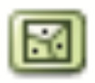
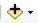
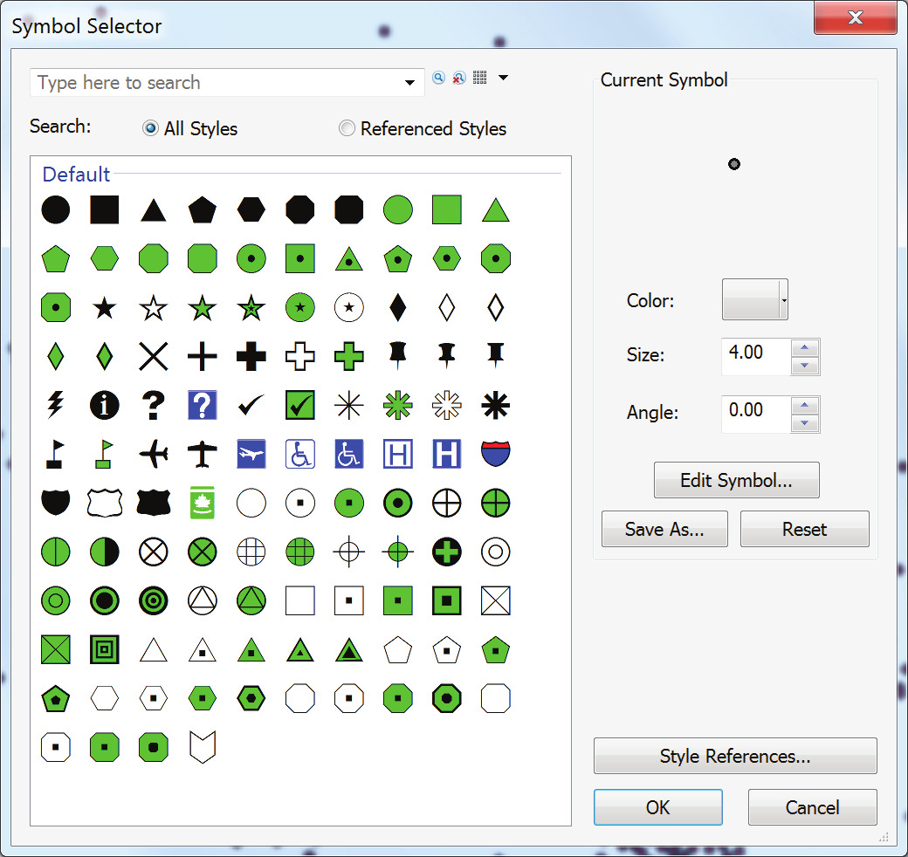
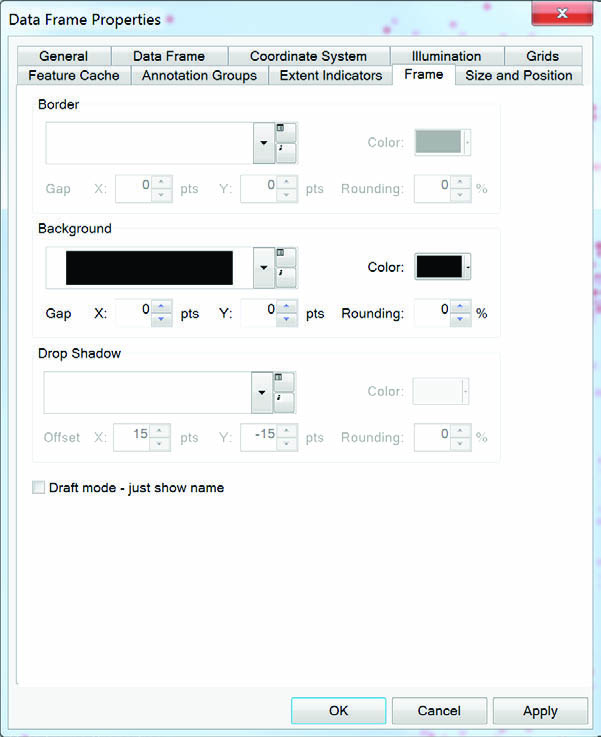
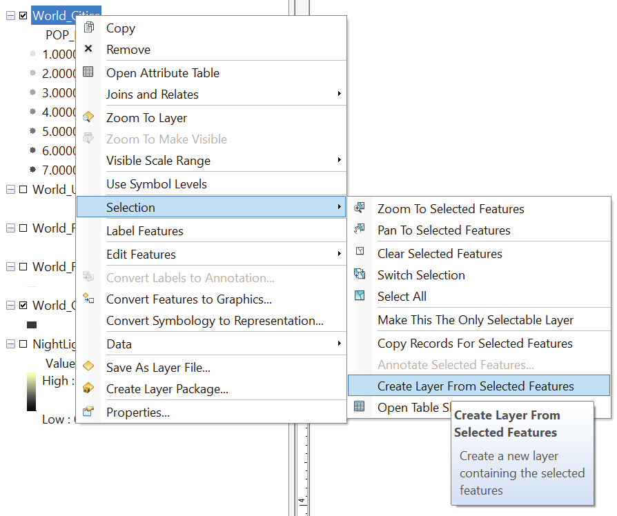
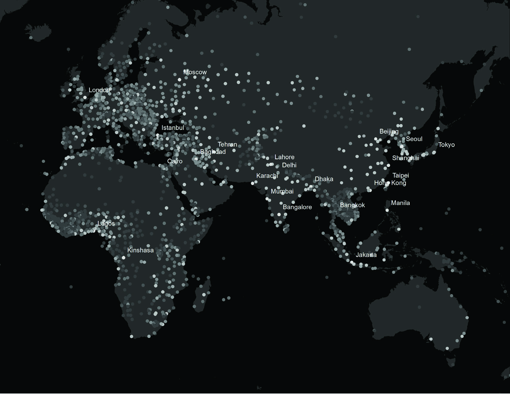
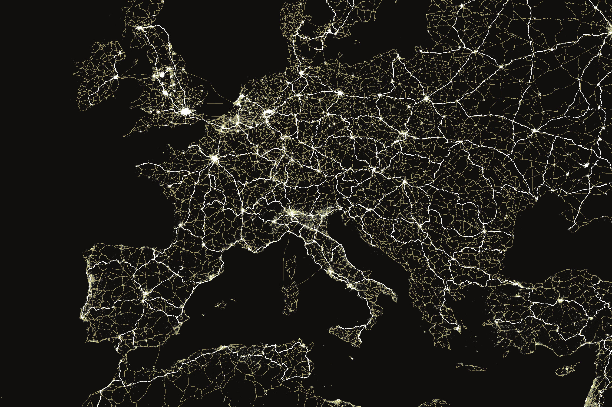
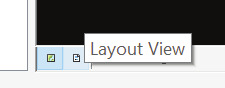

Mapping data serves multiple purposes. More than the graphic and geographic visualization of spatial information, it is a critical, analytical, and interpretive act. Mapping and GIS-based visualization contribute to knowledge formation, decision making, and community representation. Cartographic choices can both reinforce and challenge how the city is seen, how its spaces are understood, and how (and by whom) its resources are accessed. The map carries the implied weight and trust of expertise. When that map also contains quantitative and/or statistical information, it is often read as “scientific truth.” As such, mapping data is a powerful tool in urban planning—to inform the decisions planners make, to persuade in support of advocacy efforts, and to clarify and explain the spatial experiences and priorities of different groups.

After completing this exercise, students will have:

- Learned the basics of visualizing vector and raster data types
- Learned the basics of map symbology and composition
- Answered simple comparative spatial questions
- Explored differences in qualitative and quantitative mapping
- Critically discussed the composition of a map of their choice

Further, students should be able to:

- Symbolize features as well qualitative and quantitative data
- Describe the components of a shapefile
- Access summary statistics within a feature class attribute table
- Query a GIS feature class based on attributes within its table
- Export selected features to a new feature class
- Classify quantitative information within GIS software

## Basic Data Types: Representing the Urban Condition

### Mapping Project

Urbanization has become a planetary phenomenon that weaves the terrirory of the whole world into an uneven fabric of intrastructural and logistical networks. This process extends well beyond traditional city cores. Our first mapping project is to represent this condition on a global scale, and familiarize ourselves with basic spatial data types in the process. First, we will prioritize concentrated urbanization by representing world cities as dots on a map and render the rest of the world void. Second, we will challenge the city-non city binary and attempt to depict extended urbanization by adding transportation networks to our map.

### Data

Download and unzip the exercise package called “01_MappingData_Arch-UD”, saving it to your working drive.
TIP: It is highly suggested that you work on either a high-capacity (and fast) external hard drive or your computer’s local scratch drive. GIS software works by “linking” to data layer sources, constantly reading those layers wherever they are stored. Thus, working on a small, slow flash drive can noticeably slow down your processing speed. Instead, copy your files to the local drive and remember to save your work to your remote storage (whether a flash drive, external hard drive, or cloud storage) after each working session.

#### Working With Shapefiles

Before we begin working with the data, let’s examine the folder’s contents.

Open Windows Explorer [Windows + e], and navigate to the “...\01_MappingData\00_DATA\ vector.”

Notice that there are several files with the same names and different extensions. These are the components of an shapefile, a standard GIS vector file format containing exactly one feature class, which GIS software can read as a single entity.

While shapefiles vary, they all contain three necessary files types:

- **.shp** – The geometric information or “shapes.” The basic feature types are points, polylines, or polygons.
- **.dbf** – A table of attribute information, qualitative or quantitative, corresponding to the features in the .shp file.
- **.shx** – A shape index file that stores the index information for the feature geometry.

Additionally, several shapefiles may have other component files. Primary files types (for our use) include:

- **.prj** Coordinate system and projecting information corresponding to the geometric features.
- **.xml** The shapefile’s metadata.

You might notice several others. If you would like to investigate the list of shapefile extension file types, consult the ESRI ArcGIS Resources list here.

Without question, GIS data can be cumbersome (and these shapefiles represent some of the least complex GIS data types). Thus, we will work with ArcCatalog when using ESRI’s ArcGIS. ArcCatalog is a file directory program (like Windows Explorer or Apple’s Finder) specifically designed for GIS files. It will recognize GIS data as such and package the multiple related files together. It will also allow you to preview your data before adding it to a working ArcMap project.) Close Windows Explorer.

Open ArcCatalog by clicking through the “Start Menu > ArcGIS > ArcCatalog.” Click the “Connect to Folder” button (left) and navigate to (and highlight) the \01_MappingData\ folder. This will establish the “01_MappingData” folder as a working directory for us, giving us access to the data in its subfolders. (Establishing which directories are “working directories” is a common feature of many data-related software packages.)

When you have selected the folder, click OK.

Notice that once you have connected to the folder, it is present in the left panel of the ArcCatalog interface, called the Catalog Tree. From here, you can inspect its GIS-related contents using the three tabs in the right panel: Contents, Preview, and Description.

## Getting Started

Open the `\01_MappingData\vector\` folder. Notice there are several shapefiles included in the folder. Their geometry types are indicated by their icons. For your reference, a list of common icons is included below.

Basic Data/Layer Types by Icons:

|   |   |
|---|---|
||Point Shapefile|
||Polygon Shapefile|
||Polyline Shapefile|
||Raster Dataset|
||TXT or CSV|
||Database Table|

Notice primarily that the long list of files we saw in Windows Explorer is neatly organized into only a handful of shapefiles in ArcCatalog. ArcGIS is able to recognize the many related files as a single working shapefile.
DATA SOURCES:
To begin, we will use data compiled by the Esri Data and Maps group.
LAUNCH ARCMAP:
Open Arcmap by clicking through the “Start menu > ArcGIS > ArcMap.” If you are prompted to choose an ArcMap project to open, you can either chose a New Blank Map or click Cancel to dismiss the initial dialog box.

The project file is effectively a space for analysis and composition of various GIS data layers. Conceptually, it is useful to remember that the “project” file is not the “map,” nor does it contain the data used within the project. Rather, within the project file, data sets can be layered, analyzed, created, and edited. Multiple projects may reference or include a single dataset without duplicating the data. As a result, changes made to a dataset in one ArcMap project are reflected in the other projects linking to it.

Take a moment to familiarize yourself with the ArcMap interface. At a minimum, you should see the Standard Toolbar and the Tools Toolbar docked at the top of the interface. If you
do not see them, you can access your toolbars by right-clicking in the toolbar area of the interface or by clicking through “Windows > Toolbars.” (You can dock a floating toolbar by dragging and dropping it in the toolbar areas on the top, bottom, or sides of the interface.)

Standard Toolbar

Tools Toolbar

### Add Data

To add a data layer to your project, click the Add Data button, or right-click on “Layers” and choose “Add Data...”

In the Add Data dialogue box, navigate to “...\00_Data\vector” folder. (You may need to establish the “01_MappingData” folder as a working directory once again by clicking the Connect to Folder button.)

Select the “World_Cities.shp”, and click “Add.”

Notice the points representing cities populate the data frame. Each feature in the feature class is symbolized with the same arbitrary symbol/color. When hovering over data frame, examine the latitude and longitude coordinates of your mouse cursor in the lower right corner.

Here the coordinates are represented in meters from (0,0) because the data’s projection is calculated in feet. Later exercises will discuss projections and coordinate systems in greater detail. For now, there are two points of which we should be aware:

- It is important to know the units
of measure used in a data layer’s projection. In our case, this is meters.
- By default, the coordinate system and projection of an ArcMap project is determined by that of the first layer added to the project. Additional layers added may have different projections, but will be re-projected “on-the-fly” when added to the project file.
It’s easy to manually set the desired coordinate system of the data frame. Right-click on “Layers” and choose “Properties...” Click the “Coordinate System” tab and set the projection to “Predefined/ Projected Coordinate System/World/WGS 1984 World Mercator.” Click “OK.”

## Save Your Project

Before we move on, let’s save our ArcMap project.

First, recall that the data layer we’ve added is linked (not embedded) to our source shapefile. As most of you will be working on different computers or drives at different times, it will be more convenient to Save Relative Path Names rather than “absolute” path names to our linked data. This decreases the likelihood that opening the project on a different computer will result in broken links because ArcMap can’t find the name of the drive where you were previously working.

To save relative path names for your data layers, click through “File > Map Document Properties” to open the Map Document Properties dialogue box. There, check the Pathnames option to Store Relative Pathnames to Data Sources. Click “OK” to save the option.

## The Attribute Table

Recall that each feature in a feature class is represented in geometric and in tabular form. In this case, we have point features (each Wi-Fi hotspot represented as a point), and each point corresponds to an entry in a data table—an attribute table containing attribute information per feature.

To access the Attribute Table of our World_Cities shapefile, right-click on the layer name in the Table of Contents panel (TOC) and click “Open Attribute Table.”

TIP: To keep your workspace uncluttered, you can dock the Table panel (if it appears floating) by clicking and dragging it within the ArcMap interface.

Scroll horizontally to see the fields included within the attribute table. Notice we have country information, as well as city status, population, population rank, etc.
To quickly identify which point corresponds to a given feature within the attribute table, you can interactively select a feature by clicking on the button to the left of any row. This will highlight the feature in the attribute table and in the data frame in cyan.
Additionally, notice that immediately beneath the table, the panel includes text explaining that “1 out of 2540 [features are] Selected.” From this we can quickly gather the total number of features in the feature class.

**✍️ 2.1 – Interactively select the feature selected in the image above from the World_Cities shapefile’s attribute table. What is the population of that city? (HINT: Look through the information available in the table).**

Clear your selected feature(s) by clicking the Clear Selected Features button on the Table Panel or on the Tools toolbar, or navigate to menu item “Selection” and choose “Clear Selected Features.”

We can also access attributes per feature interactively through the data frame’s map by using the Identify Tool. With the Identify Tool, click on a single feature point. A new panel will appear with the values of each field in the Attribute Table for that specific feature. (Again, you can dock the panel if you choose.)

Having familiarized ourselves with the information in the World Cities shapefile, we can now set up our map by including other layers and start experimenting with map design. Given the mapping challenge we are trying to tackle, what other geographic features can we use as a proxy for representing urban condition?
In other to create an effective map, we might also include features that provide context to our map. In that case, what features shoud be highlighted and which should remain in the background? Think about those arguments and hierarchies as you proceed to the next step. We will start by adding:

- A polygon feature class of world countries
- A line feature class of world roads
- A line feature class of world railroads
- A polygon feature class of world urban areas
- A raster file of the NASA-NOAA global light emissions and reflections, also known as the “Earth at Night” or the “Night time lights” image

Note: We will bear in mind the exact spatial reference for the file, such as map projection, coordinate system, and datum).
cover georeferenced raster files in greater detail in future exercises. For now, that raster files can be spatialized (include all information necessary to establish
 Map Design
Using the “Add Data” button and dialogue box, add World_Countries_(Generalized).shp, World_Roads.shp, World_Railroads.shp, and World_Urban_Areas.shp from the “00_DATA\ vector” folder, and NightLights_2016_3km_gray_geo.tif from the “00_DATA\raster” folder.

**✍️ Q 2.2 – How many features are included in the World\_Urban\_Areas feature class?**

## Layer Order

Once again, each of the layers will be arbitrarily assigned a single color symbol. Also, depending on the order in which your new layers are added to the project, you may not be able to easily see each of them. You can rearrange your data layers’ order by clicking and dragging the layer names in the ToC (be sure that the “List by Drawing Order” option is selected in the ToC Panel).

Rearrange the layers such that (from top to bottom) they are
ordered: World Cities, World Urban Areas, World Railroads,
World Roads, World Countries, Earth at Night. You can toggle the visibility of layers by checking and unchecking the box next to their names in the ToC. Uncheck all layers except World Cities. Save your ArcMap project.

## Map Design

## Symbology

We are now entering the design phase of our first mapping project. First, we will change the appearance of the World Cities Layer. Right-click on the layer name in the ToC and click Properties to access the Layer Properties dialogue box.

Under the Symbology Tab, you will find the various symbology options. Take a moment to read the dialogue box options. On the left panel, the user can choose to “Show” Features, Categories, Quantities, Charts, or Multiple Attributes. The first option (Features, shown as single symbols) is always the default, but we will choose to show quantities via different symbology approaches. Our goal is to establish hierarchy among the features in the class.

Open layer’s attribute table and once again observe the information stored in various fields. Note that some fields contain nominal information, and others contain quantitative information – e.g. population rank (POP_RANK), which ranks cities from 1 (most populous) to 7 (least populous). We will represent those values using color gradients.

In the Symbology Tab window, click on “Quantities” and make sure that “Graduated Colors” is selected. Set the “Value” field to “POP_RANK.” Under “Classification,” set the number of classes to 7.
This will ensure that each class has a different color assigned.
Right-click on any of the
values in range and select
“Properties for All Symbols...”
Double-click on the circle
under “Current Symbol,”
which will open the Symbol
Property Editor. Set the circle size to 4, and outline color to “No Color.” Click “OK” to close the Editor and Selector.

Next we want to choose a color gradient in order to render more populous cities brighter on the map. Right-click on Color Ramp and choose “Properties...” The Edit Color Ramp dialogue will appear. Set the Color 1 to light gray, or choose a different color combination. For this exercise, a simple grayscale ramp will suffice.

TIP: While ArcMap is not a design software, there is a surprising amount of flexibility built in to alter the appearance of a feature symbol. Even though you might want to finalize the design in Adobe Illustrator, we encourage you to explore the options available through the Edit Symbol button and other options.

When you are satisfied with the symbol and colors you have chosen—you can always return to these dialogue boxes to make changes—click “OK” to return to your project.

Next, we will change the color of the data frame’s background (which is serving as the color of the area not covered by the point features). To access the Data Frame Properties dialogue box, right-click anywhere in the data frame area of the ArcMap interface and choose “Data Frame Properties.”

Set the Border to “None” and Background color to black. Click “OK.”

Finally, turn on the World Countries layer’s visibility by rechecking the box next to the layer’s name in the ToC. Change the countries’ appearance on the map by changing its symbol. Give the features dark gray fill color and no visible outline.

## Interactive Selection

Next, we will display the names of the most populous cities on the map (with populations greater than 5 million). In order to do so, we will first select the features representing those cities (population rank = 1). Open the layer’s attribute table. Right-click on “POP_RANK” and choose “Sort Ascending.” Notice that the World Cities features are now sorted by their population rank from 1 to 7 (by default, features are sorted by their unique object IDs in the “FID” field).

Interactively select all features with population rank 1 by clicking its rows in the Attribute Table.

## Selection Methods

### Select By Attributes

Another selection technique is to directly query the Attribute Table based on the fields and values within the database. We will select the same features one more time using this method. Clear your selection using the Clear Selection button.

Click on the main menu item “Selection” and choose “Select by Attributes...” We will use the population rank field as the basis of a simple query.

Take a moment to thoroughly read the options in the dialogue box. You’ll notice that the first option asks you to choose from which layer in the ArcMap project you would like to select features. We would like to select specific features from the World_Cities layer. Choose this one from the drop-down menu.
As soon as you specify the Cities layer, you should notice that the names of the Attribute fields (the columns in the Attribute Table) populate a list.
The second option asks the Selection Method. Again, take a moment to familiarize yourself with the options here, many of which are often useful. For now, we would like to Create a New Selection.

Now, notice that the bottom text box is labeled “SELECT * FROM World_CIties WHERE:” Here, the dialogue is asking that we build a simple statement clarifying which features we’re looking for in the Attribute Table. In short, every feature in the World_Cities attribute table where our expression is true will be selected. In our case, we know we want to select the features which have a value of 1 in the field labeled “POP_RANK.” We will build that statement using the options in the dialogue box.

Double-click the field name “POP_RANK” in the list of fields. You’ll notice that the lower panel is automatically populated. Click the equal sign ( = ) button. Again, notice that the equal sign is added to the lower panel.

With the “POP_RANK” entry still highlighted in the list of field names, click
the “Get Unique Values” button. This will add a list of all of the values available in layer’s Attribute Table within the highlighted field. Double-click ‘1’ in the list of options.

NOTES on the “Select by Attribute” dialogue box: Syntax here is important, as is punctuation and spacing. Until you are more experienced with this dialogue (or unless you have SQL experience in general), we strongly suggest that you always click rather than type in this dialogue. The one exception is if you make a mistake: in that case, highlight and delete everything in the lower text box and begin again.
Verify that your query expression is correct and click “OK.” Once again, same features should be selected in the map and in the Attribute Table.

## Labeling Features

### Creating a New Feature

In order to add names of the selected cities on the map, we will create a new layer containing only the selected features.

With most populous cities still selected, right- click on World_Cities layer and click through “Selection > Create Layer From Selected Features.”
This operation will automatically add a new layer called “World_Cities selection” on top of your map and assign it a default sybology. Click on the new layer twice and rename it to “World_Largest_Cities.”
Right-click on “World_Largest_Cities” and choose “Properties.” Click on the Symbology tab (Features/Single Symbol) and using the Symbol selector and Symbol Property Editor set both the Color and Outline to “No Color.” This operation will make the layer invisible on out map.
LABELS:
Label text strings are derived from one or more feature attributes. Labels are dynamic, so if feature attribute values change, the labels also change. In our case, will label features with text strings derived “CITY_NAME” field.
With “World_Largest_Cities” Layer Properties window still open, click on the “Labels” tab. Check the “Label Features in this Layer” box. Set Label Field to 

“CITY_NAME” and choose the desired font, text color, and size. Click “OK.”

## Working with Raster Data

Considering our original mapping challenge – respresenting urban condition – completing a map with abstract dots representing world’s major cities may not be the most original approch to tackle this. We will hence shift our focus to other data we’ve added to the scene and consider alternative ways to represent urbanization.

Toggle all layers off except “NightLights_2016_3km_gray_geo.tif.” This is the only raster dataset we are working with in this exercise. We will work with rasters in greater detail in future exercises. For now, bare in mind that a raster consists of a matrix of cells (or pixels) organized into rows and columns (or a grid) where each cell contains a value representing information, such as elevation or the amount of light emmitteed at night-time.

Night-Time Lights imagery has been embraced by a large number of institutions as a proxy for urbanization, density, and economic growth, among others. This is highly debatable, but we will nevertheless proceed assuming the data represents areas of concentrated urbanization.

Your map should now dispay the names of the most populous cities within the map.

**✍️ Q 2.3: Open the “World\_Largest\_Cities” Attribute Table. How many cities are in the feature class (total of those with the pupulation rank value of 1)? What percentage of the total number of World Cities have the poulation rank value of 1?**

Right-click NightLights and choose “Properties...” Click on the Symbology tab. A slightly different dialogue box will appear from the one that we’re used to when working with shapefiles. There are several different methods of rendering raster data. We will use “Stretched.” The Stretched renderer displays continuous raster cell values across a gradual ramp of colors.

Choose the Stretch Type “Minimum-Maximum.” Click “Display Background Value” and leave value at “0.” Right-click on the Color Ramp and choose “Properties...” Set “Color 2” to yellow and click “OK” all the way out (feel free to experiment more with these settings).

Next, turn off world cities layer and urban areas layer. Right-click “World_Urban_Areas” and open Attribute Table. Notice that only ordinal data (rank) is available should you want to choose colors by it. Close Attribute Table and right-click “World_Urban_Areas” again. Choose “Properties...” and click on Symbology Tab. Use the symbol swatch to set the fill color to desired color. Set the outline color to “No Color.”

Turn on railroads layer. Right-click “World_Railroads” and choose “Properties...” Click on the Symbology tab and use the symbol swatch to choose color and line weights. Repeat the steps for “World_Roads” layer. HINT: You might want to represent roads, railroads, and urban areas as componests of a single system, and hence, assign similar color values to all three layers.

You should by now be familiar with basic GIS data types, selection techniques, and symbology methods.

## Layout View

The ArcMap interface’s data view is useful when conducting analysis. When we need to compose a map, we must switch interfaces to the Layout View. Using the buttons on the lower left of the data frame, toggle between Data View and Layout View.

Notice that Layout View places the contents of the data frame onto a “page.” By default, this should be an 8.5” by 11” standard US letter sheet. Page size and orientation can be changed in Page and Print Setup. Navigate to menu item “File > Page and Print Setup.” In the dialogue window, uncheck the “Use Printer Paper Settings.” Change the orientation to “Landscape” and leave the paper size 11” x 8.5.” Click “OK.”

In layout view, the size and location of the data frame can be changed using the transform controls surrounding the data frame. If necessary, you can use the Select Elements tool on the Tools toolbar to select the data frame. Notice also that your other tools (e.g., zooming and panning tools) will operate as they did in the Data View—zooming and panning within the data frame.

Note that a new toolbar is activated in layout view: The Layout Toolbar. This contains many tools similar to those of the Tools toolbar, except they operate on the “page” rather than on the data frame. For example, panning with the Layout Pan tool will not affect the cartographic data within the data frame, but will pan around the layout page.

Resize and position your data frame on the page, zooming and panning to desired place on the map. Set the scale between 1:15,000,000 and 1:20,000,000.

### Adding Map Elements

For our purposes, most maps we produce in these exercises is expected to include the following map elements:

- A scale bar
- A legend, with pertinent information A descriptive title
Labels
- Pertinent data sources

Let’s begin by adding Scale Bar. To create a scale bar, click on the menu item “Insert > Scale Bar.” The Scale Bar Selector dialogue box will appear. Choose a scale bar style, and click “OK.”

To alter the scale bar’s appearance or units, right-click on the scale bar and click Properties to open the Scale Line Properties dialogue. If it is not already set to report the scale in miles, then change the Division Units (under the Scale and Units tab) to Miles. Although our data is projected and calculated in meters, at the scale of the continent describing the distances represented on the map in meters would be cumbersome and confusing to most readers.

The “best” choices for other options will vary depending on which scale bar style you have chosen. Take some time to test out different options (e.g., divisions, marks, frame, and background) by making changes in the Properties dialogue box and clicking Apply. When you are satisfied with the appearance of your scale bar, click OK.

TIP: Once you are familiar with these options, you can access the Properties dialogue box from the Scale Bar Selector dialogue (when you initially insert a scale bar) by clicking the Properties button (above).

TIP: You can adjust the values in your scale bar by resizing it within the layout. With this you can size the scale bar such that it reports round numbers (which are easier to read). Save your ArcMap project.

## Exporting A Map

There are several file type options for exporting a map from the Layout. Saving to a vector format (EPS, AI, etc) will preserve the vector geometry of your layers for further editing. Given that you also have a imagery on your map, you might consider exporting only the raster data of the map as JPG or TIFF and compiling them with vector data in another program.

When you are ready to start exporting, turn off all layers except the NightLights. Click through “File > Export Map.” In the dialogue box, choose where to save the map by navigating to the “\01_MappingData\Outputs\” folder. Save as type: TIFF, and set the resolution to 150dpi. Click “Save” (Before you do that, you might consider temporarily dragging the scale bar off the page so it doesn’t appear on your exported tiff).

Next, turn off NightLight layer and turn on railroads, roads, and urban areas. Click through “File > Export Map...” Save as type: AI. Open AI file in Illustrator. Place the NightLights image in the background and align layers. Adjust the colors, lineweights and transparencies. Save file as PDF.

