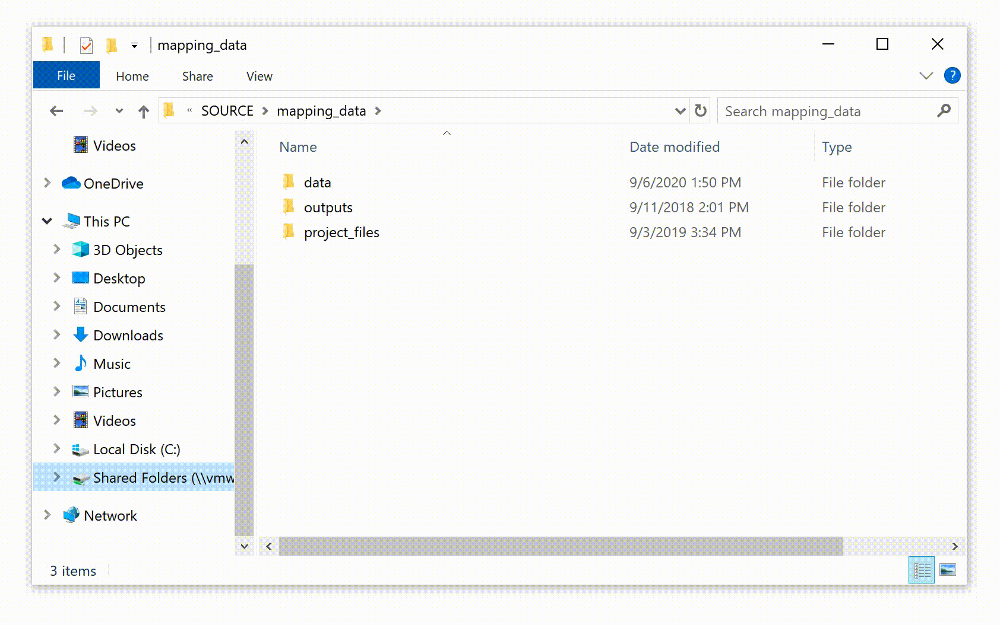
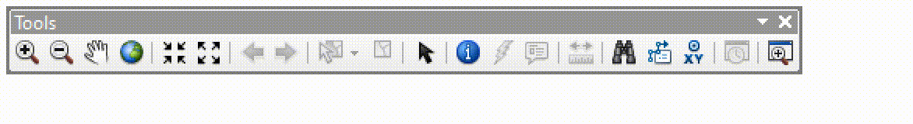
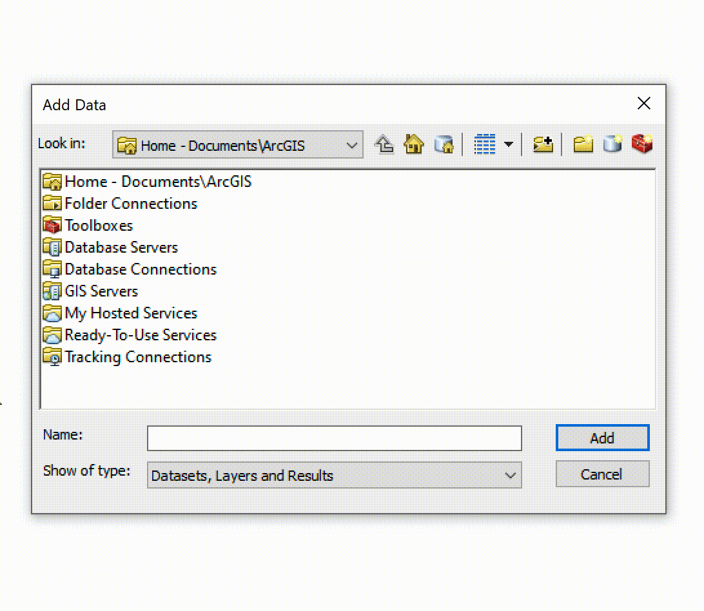
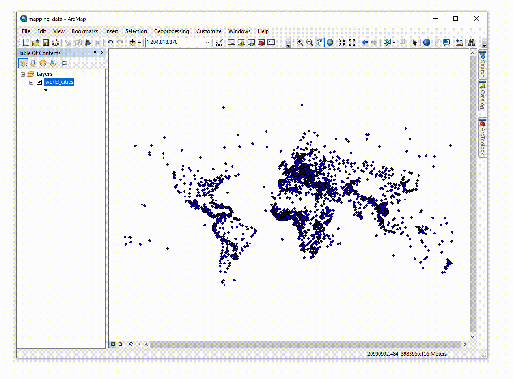
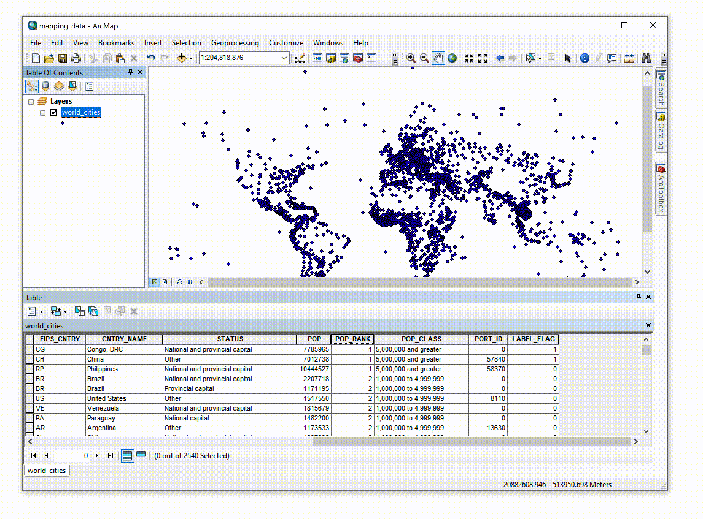
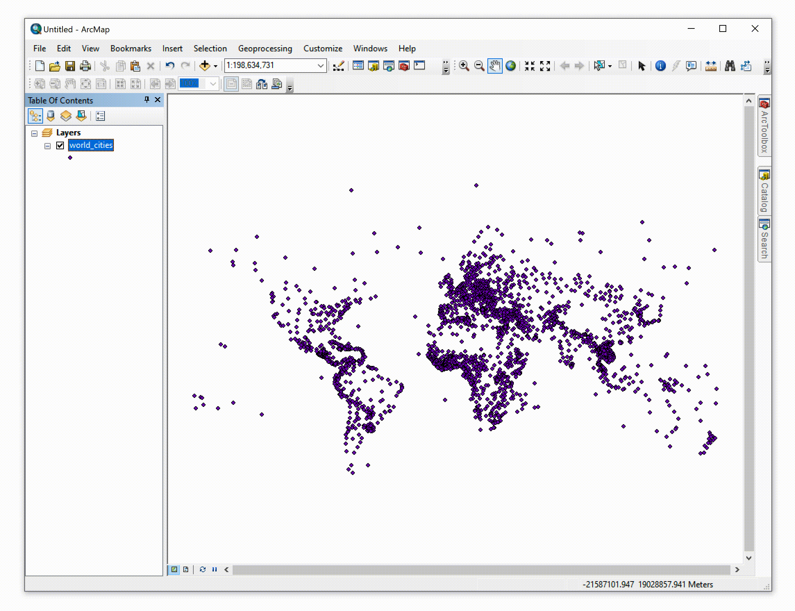
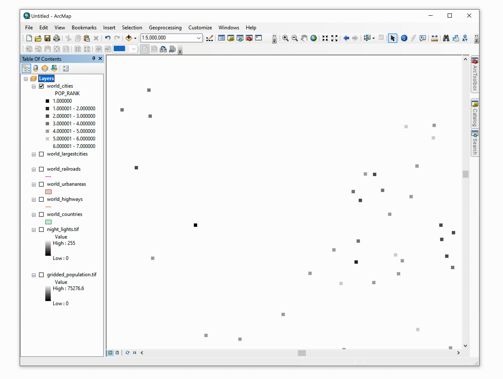
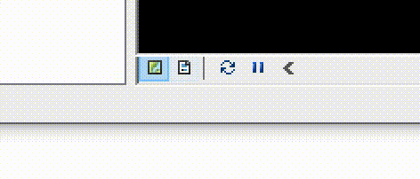

## Overview

The act of mapping serves multiple purposes. More than the graphic and geographic visualization of spatial information, it is a critical, analytical, and interpretive act. Mapping and GIS-based visualization contribute to knowledge formation, decision making, and community representation.

Cartographic choices can both reinforce and challenge how the city is seen, how its spaces are understood, and how (and by whom) its resources are accessed. The map carries the implied weight and trust of expertise. When that map also contains quantitative and/or statistical information, it is often read as a representation of objective truth.

As such, mapping data is a powerful tool in urban design—to inform decisions, to persuade in support of advocacy efforts, and to clarify and explain the spatial experiences and priorities of different groups.

### Objectives

After completing this exercise, students will have:

- Learned the basics of visualizing vector and raster data types
- Learned the basics of map symbology and composition
- Answered simple comparative spatial questions
- Explored differences in qualitative and quantitative mapping

Further, students should be able to:

- Symbolize features as well qualitative and quantitative data
- Describe the components of a shapefile
- Access summary statistics within a feature class attribute table
- Join attributes from one dataset to another via a table join
- Query a GIS feature class based on attributes within its table
- Export selected features to a new feature class
- Classify quantitative information within GIS software

### Deliverables

**Exercise Questions**. Answer all of the questions contained in the exercise, explaining how you got your answer. Record your answers in a simple table like the one below, saved as a [CSV](https://en.wikipedia.org/wiki/Comma-separated_values) file. 

| Q | A |
|---|---|
|1.1| There are 5,280 feet in a mile. |
|1.2| Raster and vector. |
|...| ... |

[template](/downloads/ccr2139_exercise1.csv)

**Map**. Use the techniques outlined in the exercise to produce a map of the world on a single 11x17 layout, saved as a PDF. See the note at the end of the exercise for detailed instructions.

Name all deliverables `yourUNI_exerciseN`, substituting your UNI, the current exercise number for N.

When you are finished with the exercise questions and map, place both files inside a ZIP archive named with the above convention (ex. `ccr2139_exercise1.zip`) and submit through canvas.

<!-- ## Basic Data Types: Representing the Urban Condition

### Mapping Project

Urbanization has become a planetary phenomenon that weaves the terrirory of the whole world into an uneven fabric of intrastructural and logistical networks. This process extends well beyond traditional city cores. Our first mapping project is to represent this condition on a global scale, and familiarize ourselves with basic spatial data types in the process. First, we will prioritize concentrated urbanization by representing world cities as dots on a map and render the rest of the world void. Second, we will challenge the city-non city binary and attempt to depict extended urbanization by adding transportation networks to our map. -->

### Setup

Download and unzip the [exercise package](/downloads/mapping_data.zip) to a convenient location on your computer.

As always, it's important to back up your work. If you're not doing so already, use the Google [Backup and Sync](https://www.google.com/intl/en-GB_ALL/drive/download/backup-and-sync/) utility to set up automatic backups to your Columbia Google Drive account.

File management isn't anybody's favorite subject but **it is critical to stay organized when working with spatial data**. GIS software works by **linking** to data stored separately from the project file on your file system, much like InDesign and most video editing and motion graphics software. If files move or disappear, the links will break and you'll waste time relinking them or even repeating work unneccessarily.

To avoid this, you should set up a **project folder** with a well-organized system of subfolders to keep track of your files whenever you start new work. The exercise packages for each assignment are already set up for you, and for the sake of following along in the instructions you should leave these as-is. But feel free to experiment with whatever works best for you once you're working on your own!

Finally, be aware that spaces and dashes in your file names can cause some of ArcGIS's processing algorithms to fail. To be safe, avoid using anything other than upper and lower-case numbers, digits and underscores.

## Working With Data

Let's look at what's in our folder. Navigate to the `/mapping_data/data` folder in your file browser and look inside `vector`.

You'll see a mess of files with different names and extensions. If you sort the list by name, groups with the same name will appear. Each group is a **shapefile**, a standard GIS vector file format. Counterintuitively, the word shape**file** actually refers to a *group of three or more files* with the same name but different extensions. Taken together they encode exactly one **feature class**. GIS software treats this feature class as a data source for a single layer. The three file extensions required to make a shapefile are:

- **.shp** contains geometric information or “shapes” as points, polylines, or polygons.
- **.dbf** is a table of attribute information, qualitative or quantitative, corresponding to the features in the .shp file.
- **.shx** provides the index information for the feature geometry.

Depending on the case, you might also see:

- **.prj** tells the software about the coordinate system and projection used for the geometry.
- **.xml** contains shapefile’s metadata.
- **many more** See [this article](https://desktop.arcgis.com/en/arcmap/10.7/manage-data/shapefiles/shapefile-file-extensions.htm) for a full list.

### A Better Way to View Data Sources

Without question, GIS data can be cumbersome (and these shapefiles represent some of the least complex GIS data types). Thus, we will work with ArcCatalog when using ESRI’s ArcGIS. ArcCatalog is a file directory program (like Windows Explorer or Apple’s Finder) specifically designed for GIS files. It will recognize GIS data as such and package the multiple related files together. It will also allow you to preview your data before adding it to a working ArcMap project.) Close Windows Explorer.

Open ArcCatalog by clicking through the “Start Menu > ArcGIS > ArcCatalog.” Click the “Connect to Folder” button (left) and navigate to (and highlight) the \01_MappingData\ folder. This will establish the “01_MappingData” folder as a working directory for us, giving us access to the data in its subfolders. (Establishing which directories are “working directories” is a common feature of many data-related software packages.)

When you have selected the folder, click OK.

Notice that once you have connected to the folder, it is present in the left panel of the ArcCatalog interface, called the Catalog Tree. From here, you can inspect its GIS-related contents using the three tabs in the right panel: Contents, Preview, and Description.

Navigate to the `/mapping_data/data` folder in ArcCatalog and look inside `vector` again. This time you'll see each shapefile represented as a single item, with its data type indicated by an icon. In ArcGIS, icons for the six basic data types look like this:

### Adding Data Sources to the Map

What if we want to actually see the geometry in one of these datasets? We need to put it on a map. Open ArcMap. If you are prompted to choose an ArcMap project to open, you can either chose a New Blank Map or click Cancel to dismiss the initial dialog box.

The project file is a space for working with spatial data. Think of it as a worktable, or a site. Here you'll arrange materials (data) and manipulate them with tools (algorithms) to make something useful.

Remember that the project file is not the map, nor does it contain the data used within the project. Rather, within the project file, data sets can be layered, analyzed, created, and edited. Multiple projects may reference or include a single dataset without duplicating the data. As a result, changes made to a dataset in one ArcMap project are reflected in the other projects linking to it.

<!-- redundant -->

Take a moment to familiarize yourself with the ArcMap interface. At a minimum, you should see the Standard Toolbar and the Tools Toolbar docked at the top of the interface. If you do not see them, you can access your toolbars by right-clicking in the toolbar area of the interface or by clicking through “Windows > Toolbars.” (You can dock a floating toolbar by dragging and dropping it in the toolbar areas on the top, bottom, or sides of the interface.)

#### Standard Toolbar

#### Tools Toolbar

<!-- TO-DO: tour of the interface, table of contents, toolbars, catalog, toolbox, search, data frame, coordinates display -->

On the left you'll see the **Table of Contents** and on the right there are tabs for **Catalog** (basically an embedded version of ArcCatalog within ArcMap) and **Search**. The blank white area in the middle of the window is showing the (empty) contents of the **Data Frame** labeled *Layers* in the Table of Contents.

#### Add Data

To add a data layer to your project, click the Add Data button on the Standard Toolbar, or right-click on “Layers” in the Table of Contents and choose “Add Data...”

In the Add Data dialogue box, navigate to the vector data folder we last saw in ArcCatalog. (You may need to establish the “01_MappingData” folder as a working directory once again by clicking the Connect to Folder button.)

<!-- CLARIFY -->

Select the “World_Cities.shp”, and click “Add.”

Points representing cities should appear in the Data Frame. Each feature in the feature class is symbolized with the same arbitrary symbol/color. Move your cursor around in the Data Frame. Observe that as the position of the cursor changes, ArcMap displays its current coordinates in the lower right corner of the window.

Here the coordinates are represented as meters from the data frame's origin (0,0) because the dataframe's **projection** uses meters for its units. We'll talk more about projections later, but for now, there are two things you should know:

- It is important to know the units of measure used in a data layer’s projection.
- By default, **the coordinate system and projection used in an ArcMap project are determined by the first layer added**. Layers added later may be recorded in different coordinate systems, but they will be re-projected “on-the-fly” when added to the project file to match the project settings.

The coordinate system used in your project is an attribute of the data frame. You can change it in the data frame properties, accessed by right-clicking “Layers” and choosing “Properties..." Click the “Coordinate System” tab and set the projection to “Predefined/ Projected Coordinate System/World/WGS 1984 World Mercator.” Click “OK.”

#### Save Your Project

Before we move on, let’s save our ArcMap project.

First, recall that the data layer we’ve added is linked (not embedded) to our source shapefile. As most of you will be working on different computers or drives at different times, it will be more convenient to Save Relative Path Names rather than “absolute” path names to our linked data. This decreases the likelihood that opening the project on a different computer will result in broken links because ArcMap can’t find the name of the drive where you were previously working.

<!-- explain -->

To save relative path names for your data layers, click through “File > Map Document Properties” to open the Map Document Properties dialogue box. There, check the Pathnames option to Store Relative Pathnames to Data Sources. Click “OK” to save the option.

Finally, **save the file** under `mapping_data/project_files` as `mapping_data`.

### The Attribute Table

We learned in lecture that each feature in a feature class is represented by geometry *and* by attribute properties. We can access these properties through the **Attribute Table**.

To access the Attribute Table of the `world_cities` layer, right-click the layer name in the Table of Contents and select “Open Attribute Table.”

Scroll horizontally to see the fields included within the attribute table. Notice we have country information, as well as city status, population, population rank, etc.

To quickly identify which point corresponds to a given feature within the attribute table, you can interactively select a feature by clicking on the button to the left of any row. This will highlight the feature in the attribute table and in the data frame in cyan.

Additionally, notice that immediately beneath the table, the panel includes text explaining that “1 out of 2540 [features are] Selected.” From this we can quickly gather the total number of features in the feature class.

To keep your workspace uncluttered, you can dock the Table panel (if it appears floating) by clicking and dragging it within the ArcMap interface. You can use this function for any toolbar or panel in the ArcMap interface.

Clear your selected feature(s) by clicking the Clear Selected Features button on the Table Panel or on the Tools toolbar, or navigate to menu item “Selection” and choose “Clear Selected Features.”

#### Identify Feature Attributes

We can also access attributes per feature interactively through the data frame’s map by using the Identify Tool. With the Identify Tool, click on a single feature point. A new panel will appear with the values of each field in the Attribute Table for that specific feature.

<strong>Question 1.1</strong> Use the Identify Tool to access attributes for the southernmost city in the world_cities feature class. What is its name? Compared with its two nearest neighbors, is it the largest or smallest city in the area in terms of population?

### Selection

Next, we will display the names of the most populous cities on the map (with populations greater than 5 million). In order to do so, we will first select the features representing those cities (population rank = 1). Open the layer’s attribute table. Right-click on “POP_RANK” and choose “Sort Ascending.” Notice that the World Cities features are now sorted by their population rank from 1 to 7 (by default, features are sorted by their unique object IDs in the “FID” field).

Interactively select all features with population rank 1 by clicking its rows in the Attribute Table.

#### Select By Attributes

Another selection technique is to directly query the Attribute Table based on the fields and values within the database. We will select the same features one more time using this method. Clear your selection using the Clear Selection button.

Click on the main menu item “Selection” and choose “Select by Attributes...” We will use the population rank field as the basis of a simple query.

Take a moment to thoroughly read the options in the dialogue box. You’ll notice that the first option asks you to choose from which layer in the ArcMap project you would like to select features. We would like to select specific features from the World_Cities layer. Choose this one from the drop-down menu.

As soon as you specify the Cities layer, you should notice that the names of the Attribute fields (the columns in the Attribute Table) populate a list.
The second option asks the Selection Method. Again, take a moment to familiarize yourself with the options here, many of which are often useful. For now, we would like to Create a New Selection.

Now, notice that the bottom text box is labeled “SELECT * FROM World_CIties WHERE:” Here, the dialogue is asking that we build a simple statement clarifying which features we’re looking for in the Attribute Table. In short, every feature in the World_Cities attribute table where our expression is true will be selected. In our case, we know we want to select the features which have a value of 1 in the field labeled “POP_RANK.” We will build that statement using the options in the dialogue box.

Double-click the field name “POP_RANK” in the list of fields. You’ll notice that the lower panel is automatically populated. Click the equal sign ( = ) button. Again, notice that the equal sign is added to the lower panel.

With the “POP_RANK” entry still highlighted in the list of field names, click
the “Get Unique Values” button. This will add a list of all of the values available in layer’s Attribute Table within the highlighted field. Double-click ‘1’ in the list of options.

Syntax here is important, as is punctuation and spacing. Until you are more experienced with this dialogue (or unless you have SQL experience in general), we strongly suggest that you always click rather than type in this dialogue. The one exception is if you make a mistake: in that case, highlight and delete everything in the lower text box and begin again.

Verify that your query expression is correct and click “OK.” Once again, same features should be selected in the map and in the Attribute Table.

#### Creating New Layers from Selections

With the most populous cities still selected from the previous step, right-click on the `world_cities` layer and then through “Selection > Create Layer From Selected Features.” When prompted, click "Yes" to add the new layer to your dataframe.

This operation will add a new layer called `world_cities selection` to the dataframe, but it uses the same shapefile as the original as its source. Click on the new layer's name twice to rename it to `world_cities_largest`.

An entirely new shapefile can also be created from the features in the selection. Although there are other ways to use a subset of data for processing and visualization, this technique can sometimes help improve performance and keep your data organized.

To do this, right-click the layer, choose Data > Export Data and follow the steps in the prompt.

### Adding Attributes From Another Layer

One way we can start to create connections between datasets is through a **join**. Joins use two data layers – a **target layer** and a **join layer** – to create a new version of the target layer with additional attributes taken from matching attributes in the join layer.

In a **table join**, that relationship is defined by a common attribute field. We'll try this using our `world_cities` layer as the target, and the file `world_cities_nicknames.csv` as the join layer.

To create the join, right-click `world_cities` and select Joins and Relates > Join. For now we want to "Join attributes from a table" in the first drop-down. Select `CITY_NAME` as the target field in drop-dow for item 1, then navigate to the `world_cities_nicknames` file in your project folder under item 2. Finally, select `CITY_NAME` again for item 3. Select "Keep All Records". Click "Validate Join" to check the results and click OK to perform the join.

Open the Attribute Table and scroll horizontally all the way to the right. You'll see two new fields including `NICKNAMES` for the 30 most populous cities. Like the Layer from Selected operation above, the results are just a view taken from the original data sources. If you want to create a new shapefile with the newly joined attributes included, you can save it as a new layer.

<strong>Question 1.2</strong> What is the nickname for Hong Kong? What about for the most populous city in the dataset?

## Working with Raster Data

We can add **raster** data to the map the same way we do vectors. Click the Add Data button and navigate to the `data/raster` folder. Add `night-lights.tif` to the map.

ArcMap will ask if you want to create pyramids for the layer, click Yes using the default settings. You should see what looks like a black-and-white world map appear on screen.

Unlike vector data, which represents geometry as **discrete** objects in space, raster data represents a **continuous** surface of geographic territory. Instead of object properties like names, populations and nicknames, the attributes of raster data are represented as changes in a variable across the surface. We call these variables **bands** and they are always encoded numerically. The structure of a raster is the same as any other digital image, except the boundaries of each pixel have specific geographic locations. To underscore this difference, we call them **cells** in this class instead of pixels. We'll get a more thorough introduction to raster data in Week 5.

## Map Design

Now that we've learned the basics of the ArcMap interface, seen what's in the `world_cities` shapefile, and learned how to add data from tables and raster sources, we can think about making what we normally think of as a map, that is, a designed document that shows us geographic information and attributes *visually*.

Let's start by adding some more layers. Find the following data sources in the exercise package and add them to the map:

- A polygon feature class of `world_countries`
- A line feature class of `world_highways`
- A line feature class of `world_railroads`
- A polygon feature class of `world_urbanareas`
- A *raster* file of the NASA-NOAA global light emissions and reflections, also known as the “Earth at Night” or the “Night time lights” image (`night_lights`)

<strong>Question 1.3</strong> How many features are included in the <code>world_urbanareas</code> feature class?

### Layer Order

Just like with writing and drawing, establishing a **hierarchy** of information within our map helps communicate a clear message. Your map just went from having three layers to eight – time to decide what to emphasize!

One tool we have to control visual hierarchy is the layer order. In ArcMap, we can control this by clicking and dragging the layer names in the Table of Contents (be sure that the “List by Drawing Order” option is selected). Remember you can also turn layers on and off using the checkboxes next to their names.

This helps, but it's a bit of a blunt tool. You'll notice larger polygons and rasters will simply cover up features underneath. But sometimes, this is what you want. Zoom in to a feature in the `world_urbanareas` layer. Do you want your `highways` and `railroads` above or below? What you choose might be different depending on the message you want your map to convey.

### Labeling Features

Another way we can direct attention to information is by using labels. Here we'll literally "draw out" some of the attributes onto the surface of our map.

Right-click on `world_cities_largest` and choose “Properties.” Click on the Symbology tab (Features/Single Symbol) and using the Symbol selector and Symbol Property Editor set both the Color and Outline to “No Color.” This operation will make the layer invisible on out map.

Labels are dynamically drawn from one or more attributes of a feature – this means as the data changes, the labels change too. In our case, we'll label features using the “CITY\_NAME” field.

With the `world_cities_largest` Layer Properties window still open, click on the “Labels” tab. Check the “Label Features in this Layer” box. Set Label Field to “CITY_NAME” and choose the desired font, text color, and size. Click “OK.”

### Symbology

Have you noticed your map doesn't look the same as the exercise images? When we added each vector layer, it was randomly assigned a color. Nobody dresses themself in the morning with random clothes. Rather, we choose what we wear based on how we want to appear in a context and what we want to communicate. You should make the same kinds of decisions for your data; how it appears on the map should be a conscious choice, meant to serve a purpose.

Let's explore our options with the `world_cities` layer. Right-click on the layer name in the Table of Contents, click Properties and navigate to the Symbology tab.

Take a moment to read through the options. In the panel on the left, you can choose to show Features, Categories, Quantities, Charts, or Multiple Attributes. The first option (Features, shown as single symbols) is always the default, but let's change this to Quantities (Graduated Colors) to render the points in different colors based on the value of a numeric attribute. This will help us create a sense of visual hierarchy.

Remember that the attribute table showed attributes containing both text (like CITY\_NAME and CNTRY\_NAME) and numbers (POP, POP\_RANK). In the "Value" drop-down, you'll see only the subset of fields that contain numbers. Select POP_RANK.

Next, under “Classification,” you can control how many different symbols to show across the range of values, and how the range is split up. Since there are seven levels in the POP_RANK field, it makes sense to select "7" from the drop-down to show a different symbol for each unique value.

We can change the overall appearance of the symbols by shift-selecting all seven items in the list, then right clicking one of them and selecting "Properties for Selected Symbols". In the Symbol Selector dialog, use the Edit Symbol button to change the outline, size and style of the symbol. Leave the Color property as-is since that's being generated by the classification.

The Color Ramp drop-down gives us a choice of color scheme. Choose a [sequential](https://web.natur.cuni.cz/~langhamr/lectures/vtfg1/mapinfo_2/barvy/colors.html#seq), rather than [diverging](https://web.natur.cuni.cz/~langhamr/lectures/vtfg1/mapinfo_2/barvy/colors.html#diverging) scheme since our values are arranged in a linear sequence from low to high. You can also create a custom ramp by right-clicking on the drop-down and choosing“Properties...”.

#### Changing the Appearance of the Data Frame

Next, we will change the color of the data frame’s background (which is serving as the color of the area not covered by the point features). To access the Data Frame Properties dialogue box, right-click anywhere in the data frame area of the ArcMap interface and choose “Data Frame Properties.” Set the Border to “None” and Background color to black. Click “OK.”

#### Polyline Symbology

Turn on the `world_railroads` layer. Access its Layer Properties and use the options under the Symbology tab to choose color and line weights. Notice we have different options since lines and points are drawn in different ways. Repeat for `world_highways`. Think about how, or whether, you want to show difference between the two.

#### Polygon Symbology

Finally, turn on the `world_countries` layer and change its appearance. If you want to include `world_urbanareas` in your map, change its symbology too.

While ArcMap is not a design software, there is a surprising amount of flexibility built in to alter the appearance of a feature symbol. Sometimes you'll want to finalize the design in another software like Adobe Illustrator, but we encourage you to explore the options available through the Edit Symbol button and other options.

### Changing the Appearance of a Raster

Raster Symbology options are accessed the same way as for vector data. This time, though, the options are quite different. There are several different methods of rendering raster data. We will use “Stretched.” The Stretched renderer displays continuous raster cell values across a gradual ramp of colors.

Choose “Standard Deviations” as the Stretch Type, then click “Display Background Value” and leave the value at “0.” Right-click on the Color Ramp and choose “Properties...” Set “Color 2” to yellow and click “OK” all the way out (feel free to experiment more with these settings).

### Layout View

So far, we've been looking at the contents of our data frame through "Data View". Like AutoCAD or Rhino, ArcMap also has a Layout View to help compose scaled layouts for print or PDF. You can switch views using the buttons on the lower left corner of the viewer.

By default, you'll see a US Letter sheet, oriented as Portrait when you switch to Layout. Page size and orientation can be changed under File > Page and Print Setup. Uncheck “Use Printer Paper Settings,” change the orientation to landscape and the page size to 11x17 (also listed as Tabloid in the Standard Sizes drop-down.

The Layout Toolbar should appear when you switch the view. The Pan and Zoom tools in this toolbar control how we see the page itself, as if we were moving a sheet of paper around on a table. The Tools Toolbar controls still change the view of the data frame itself, just like before, and you can still use Select Features and Identify the same way. The Select tool can be used to resize and arrange elements on the page. The map scale drop-down in the Standard Toolbar can be used to accurately set the dataframe to a standard or custom map scale.

Resize and position your data frame on the page, then scale and pan the data frame to show the desired area. If you haven't saved your project recently, do so now.

### Adding Graphic Elements

The map itself should always carry as much of the message as possible, but it's almost always helpful to include standard graphic elements in your composition. Maps produced for this class should almost always include:

- Scale bar
- Legend
- Labels
- A title
- Data sources

Let’s begin by adding a Scale Bar. To create a scale bar, click on the menu item “Insert > Scale Bar.” The Scale Bar Selector dialogue box will appear. Choose a scale bar style, and click “OK.”

To alter the scale bar’s appearance or units, right-click on the scale bar and click Properties to open the Scale Line Properties dialogue. If it is not already set to report the scale in miles, then change the Division Units (under the Scale and Units tab) to Miles. Although our data is projected and calculated in meters, at the scale of the continent describing the distances represented on the map in meters would be cumbersome and confusing to most readers.

The “best” choices for other options will vary depending on which scale bar style you have chosen. Take some time to test out different options (e.g., divisions, marks, frame, and background) by making changes in the Properties dialogue box and clicking Apply. When you are satisfied with the appearance of your scale bar, click OK.

Once you are familiar with these options, you can access the Properties dialogue box from the Scale Bar Selector dialogue (when you initially insert a scale bar) by clicking the Properties button (above).

You can adjust the values in your scale bar by resizing it within the layout. With this you can size the scale bar such that it reports round numbers (which are easier to read). We'll go over creating a legend in future exercises, for now, try using Insert > Title and Insert > Text to provide more information for your viewer.

### Exporting A Map

There are a few file type options available when it's time to export your Layout. Saving to a vector format (EPS, AI, etc) will preserve the vector geometry of your layers for further editing (e.g. in Illustrator). Since your project contains raster data, you might also want to export that separately as a JPG or TIFF for editing in Photoshop before combining it with the vector layers again in Illustrator or InDesign.

If you do choose to export vectors separately, it's a good idea to also temporarily remove all of the graphic elements from your layout, since otherwise these will appear as part of the image.

To export, click through “File > Export Map.” In the dialogue box, choose a location in your project folder to save the map. Choose the desired file type and click “Save.”

For your final map, you can either compose it completely in ArcMap, or experiment with further editing/compositing in Creative Suite.

---

Tutorial by Leah Meisterlin & Grga Basic. Adapted for online distribution by Carsten Rodin, Fall 2020.
