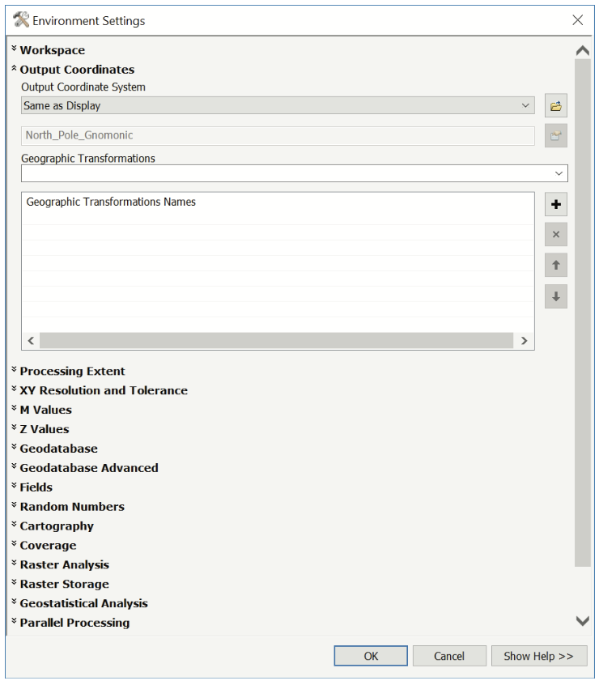
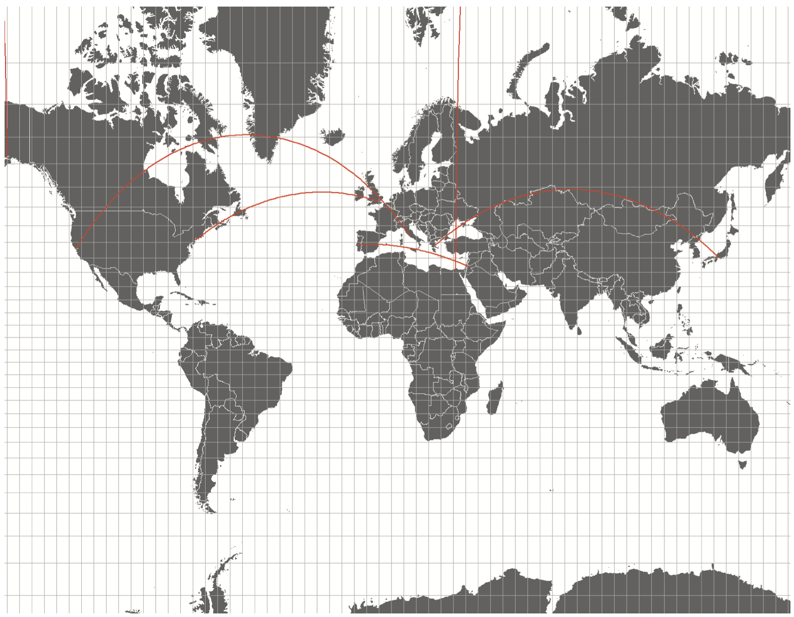

## Overview

Geoprocessing is the heart of spatial analysis. It is the collection of operations that allow for the creation of new information based on spatial relationships between features and their attributes, whether found within one data set or spread across several data sets. By combining geoprocessing techniques, complex yet straightforward analyses can be built upon our ability to map data toward answering spatial questions. Given the reliance of spatial analysis on the geographic specificities of our data, working toward developing analytical methods also means developing a firm grasp of coordinate systems and their implications for measuring position and other spatial relationships.

After completing this exercise, students will have:

- Reviewed the concepts of projection and coordinate systems
- Project and re(project) a feature class
- Answered simple comparative spatial questions
- Executed a multi-part, geoprocessing-based method to answer a spatial question

Further, students should be able to:

- Identify the coordinate system of a feature class
- Add and calculate new fields in an attribute table
- Calculate the area of polygon features
- Work with basic geoprocessing operations
- Execute a spatial join

### Deliverables

For Exercise 2, you'll need to complete the main exercise for all lab sections (available through the course-wide canvas page) and a supplemental exercise for the Arch/UD lab sections only (below).

**Exercise Questions**. Answer all of the questions in both exercises, explaining how you got your answer. Note that there are questions in both the main and supplemental exercises. Record your answers in a simple table like the one below, saved as a [CSV](https://en.wikipedia.org/wiki/Comma-separated_values) file. 

| Q | A |
|---|---|
|1.1| There are 5,280 feet in a mile. |
|1.2| Raster and vector. |
|...| ... |

[template](/downloads/ccr2139_exercise1.csv)

**Map**. As you work through the supplemental exercise you'll create four different maps in different projections. There is no separate map deliverable for the main exercise. For the assignment submission, arrange these in a single 11x17 layout, saved as a PDF.

Name all deliverables `yourUNI_exerciseN`, substituting your UNI, the current exercise number for N.

When you are finished with the exercise questions and map, place both files inside a ZIP archive named with the above convention (ex. `ccr2139_exercise1.zip`) and submit through canvas.

---
 

## Supplemental Exercise

Most map users give little thought to the map projection used for a large-scale map (map of a small area). As the map scale becomes smaller and the area shown increases, the properties of a map projection become increasingly more important and apparent. Whether we are reading or creating a map, it is important to be aware of the projection. Purposely or not, maps are political objects, and the choice of projection is a critical one. What aspects of a map are represented accurately, and which are distorted – and are those choices appropriate to what’s being communicated? In the first part of the exercise, we will familiarize ourselves with different map projections, reveal its characteristics, advantages (and disadvantages), and explore the workflow between CAD/Rhino and ArcMap in the process.

### Setting Up

Download and unzip the the [exercise package](/downloads/exercise_2_updated.zip), saving it to your working drive.

Launch ArcMap and create a new, blank map project. Immediately save the new project as AnalyzingData1_Part1.mxd in your project folder. (Reminder: if you will be moving your work from one drive to another, be sure to “Save relative pathnames” in the Map Document Properties option dialogue.)

### Displaying a Lat/Lon grid

For this exercise, we'll use three datasets that can be found in the exercise package under `data/vector`: `world_cities`, `world_countries` and `graticule` (a fancy term for a Latitude/Longitude grid). Add each one to your map.

Next, adjust the symbology of each layer. Right-click `world_countries` and choose “Properties.” Under “Symbology” set Fill Color to 60% gray and outline color to white. Also change the symbol for `world_cities`. 

Make sure `graticule` is on top in the drawing order. As you notice, 1-degree grid at this scale clogs the map, so we'll want to apply different symbology to this layer as well to make the map easier to read.

Open the layer's attribute table. Notice it contains attributes that allow it to display grids at intervals of 1, 5, 10, 15, 20, and 30 degrees. Access the “Symbology” tab of the layer and select “Categories/Unique Values.” Set Value Field to “DEGREE5.”

Click on “Add Values...” and Select “Y.” Click “OK.” Double-click on “Y” and set the line color to 30% gray and line width to 0.6. Click “OK.” Uncheck the “all other values” box and click “OK.”

You should now have a coarser grid displayed on your map. Save your ArcMap project.

### Projections in GIS Software

Working with geospatial information in GIS software means working with coordinate systems and, usually, projected data. Before we get started, there are a few software-related concepts to cover.

Recall that GIS data usually contains information about its coordinate system—datum, projection, etc. (In shapefiles, this information is stored in a PRJ file associated with the shapefile.) Knowing the coordinate system of one’s data is essential to working with it appropriately. This information also allows the software to re-project the data “on-the-fly.” In other words, GIS software can use the coordinate system information to re-project multiple different layers into the same projection in the data frame such that they align within the working space of the map project.

On-the-fly projection can be quite beneficial, but is not always as effective as the data frame might make it appear. In instances when the software is re-projecting layers based on different datums (versus different projections based on the same datum), positional errors are more likely to occur. In these cases, a user will usually be met with a warning pop-up which might indicate a need to transform your data (recalculate its positional information from one datum to another).

The ability to project data on-the-fly should suggest to you that the coordinate information of each dataset and the coordinate information of the data frame are conceptually separated in the environment of GIS software. By default, the coordinate system of the data frame is established by the first layer added to a map project.

In our case, the world countries shapefile was the first layer we added to the project. As such, its coordinate system information has been assigned to the data frame. From this point forward, new data layers added to the project would be re-projected to match the coordinate system and projection of the data frame. At any point while working, we can change the coordinate system and/or projection of the data frame, and all layers within the project will be re-projected again to match. Again, this continual on-the-fly re-projection does not alter or transform the underlying coordinate system information of the individual datasets. (To do that, we would need to employ a specific tool that transforms and/or re-projects and exports a new dataset with a different coordinate system.)

### Comparing Projections

The coordinate information of any data layer can be identified in the layer’s Properties dialogue box in ArcMap. Access the World Countries shapefile’s properties dialogue by right-clicking on the layer’s name and choosing Properties. Under the Source tab, you will find its coordinate information.

World Countries shapefile has a “Geographic Coordinate System” and “Projected Coordinate system” which means that it is associated with coordinates of a specific datum, and a specific projection. Sometimes we may encounter so-called “unprojected” shapefiles – they have an assigned datum, of course, but a specific projection has not been applied to it. As a result, the latitude and longitude coordinates would be plotted in a regular grid.

### Projections By Type

Let’s review the primary types and categories of projections. Projections are categorized by two factors: the spatial properties they are designed to preserve and the shape of the projective surface employed to construct them.

#### By Preserved Spatial Properties

- **Conformal** projections preserve local angles—thereby also preserving the
shape—of features. Maps created with a conformal projection will therefore
more or less “look right” when compared to the features on the Earth’s surface.
- **Equivalent or equal-area** projections preserve the relative areas of features.
- **Equidistant** projections will preserve the distance between two points on the
map.
- **Azimuthal** projections preserve the direction between two points along a
straight line connecting them on the map. On an azimuthal map, that straight line is known as a rhumb line and intersects each parallel and meridian at a constant angle.

#### By Surface

- **Conic** projections employ a cone as the projective surface. Maps made with
conic projections are characterized by curved parallels and meridians that converge toward the apex of the cone (which is often, but not necessarily, positioned over one of the poles).
- **Cylindrical** projections employ a cylinder as the projective surface. Basic cylindrical projections (those that have not been further edited to preserve specific spatial properties) are characterized by parallels and meridians that intersect at right angles, neither of which converge or curve.
- **Azimuthal or planar** projections employ a plane as the projective surface, most closely resembling familiar orthographic projections.
- Cartographers can alter the orientation of the projective surface relative to the reference model of the Earth. Polar and equatorial orientations are pointed toward the poles and equator, respectively. Oblique projections orient the projective surface anywhere between a pole and the equator.
- Where the projective surface is tangent to or intersects the “Earth” (or, more accurately, a reference model of the Earth or a datum) display no scalar distortion on the map. These are referred to as standard parallels or meridians. A simple projection has one standard; a secant projection has two. The further away from a standard, the greater the distortion on the map.

<strong>Question 2.1</strong> What are the linear units associated with the projection of the World Cities layer? If we were to measure distances between two points on our map, would this layer’s projection be appropriate for that? Explain why.

### Changing the Projection of the Data Frame

To change the projection of the data frame, right-click anywhere in the data frame and choose Data Frame Properties. Under the Coordinate System tab, click through “Projected Coordinate Systems > Polar > North Pole Gnomonic”. Once this projection is set, do not change it until the instructions tell you to!

Read through the information about this projected system in the lower panel of the dialogue box. There, you’ll find information on the datum and projection of the system. In addition to its name indicating that the projection is gnomonic, you’ll find the location of its standards, the central meridian and latitude of origin, and the linear units of the system.
In a gnomonic projection, great circles are mapped to straight lines. This unique property makes easy finding the shortest route between any two points (although not the direction to follow).

### Import/Export for Rhino

The workflow between ArcMap and CAD software is fairly simple and straightforward. Individual layers can be exported by right- clicking on layer’s name and clicking through “Data > Export to CAD...”

We will export both `world_cities` and `world_countries`. Choose either of the two layers for export, and in the dialogue box, use Input Features drop down menu to add the second layer to the list. Change the output type to “DXF_R2004.”

Next, click on the “Environments...” button and choose the “Output Coordinates” tab. Set the Output Coordinate System to “Same as Display.”

Save the dxf file as “WorldMap.dxf” to your working folder. A version of a dxf file will load into your ArcMap scene. Remove it by right-clicking on the layer and choosing “Remove”.

### Draw Shortest Paths

The following few steps assume working familiarity with Rhino.

Open Rhino and import the dxf file you just created. Make sure dxf is set as the import file type in the dialogue box.

Create a new layer in Rhino and call it “Paths.” Using the line tool (make sure “Paths” is the active layer), draw straight-line paths between various world cities.

Because we are drawing straight lines in a Gnomonic projection, these are the shortest paths between any two points.

**Important!** Select all paths by right-clicking layer’s name and choosing “Select Objects.” Type “Rebuild” in the command line and choose 100 points of degree 2. This will split the lines we just drew into polylines with additional vertices spaced evenly along their length. Click through “File > Export Selected” and save file as “shortestPaths.dxf.” Set the export scheme to “2004 Polylines.”

<strong>Question 2.2</strong> Explain why we chose Output Coordinate System “Same as Display” as opposed to “Same as Input” while exporting data from ArcMap to CAD.

### Convert DXF to SHP

Return to ArcMap and click “Add Data...” Navigate to “shortestPaths.dxf” and add it to your map. Ignore any warnings about spatial references, if prompted.

Expand the newly-created layer and highlight “shortestPaths.dxf Polyline.” Right-click on it and choose “Export Data...” Use the same coordinate system as the data frame. Save the file as “shortestPaths.shp” in a folder of your creation. Click “OK.”

You’ve now created a projected shapefile of the shortest paths which will allow us to re-project it “on-the-fly.” Add new shapefile to the scene and remove the dxf file.

## Show the Map in Another Projection

First, we'll see what our imported CAD file looks like in a **Mercator** projection. Right-click anywhere in the data frame and choose “Data Frame Properties...” Under Coordinate System tab, navigate through “Projected Coordinate Systems > World > WGS_1984_World_Mercator.” Click “OK.”

Notice that the paths are now displayed as curves. Navigate to “File > Page and Print Setup” and create a letter size layout in landscape format. In Layout View, resize and position your data frame on the page, zooming and panning to create a world map. Export your map.

What does it look like if we choose a **Peters** projection instead? Access the Coordinate Systems tab of the Data Frame Properties again, and navigate through “Projected Coordinate Systems > World > Cylindrical Equal Area (World).” Double-click on the projection to access the Coordinate System Properties. Change the Name to “Peters” and set the Standard Parallel to 45 degrees. Click “OK.” Once you are happy with the layout, export your map.

Finally, let's look at a **Robinson** projection. Change the projection one last time by clicking through “Projected Coordinate Systems > World > Robinson (World). Export your map.

You can explore more projections by selecting them from the World and Polar menus. Choose one and export your map one last time.

## Calculating Densities in ArcMap

This section describes how to calculate street tree densities for the geoprocessing exercise (see PDF on Canvas for full instructions). Because of a mix-up, the instructions on modifying the attribute table as needed for this step were omitted from the exercise PDF.

Here's what you need to do: first, add a new field for area (`area_acre`) and use Calculate Geometry to populate it with values as shown in this animation:

Next, add one more field for the density (`trees_acre`) and use the Field Calculator to compute the density:

---

Tutorial by Grga Basic, Fall 2018.
