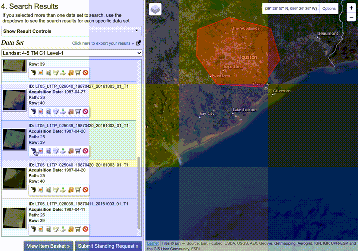
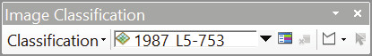
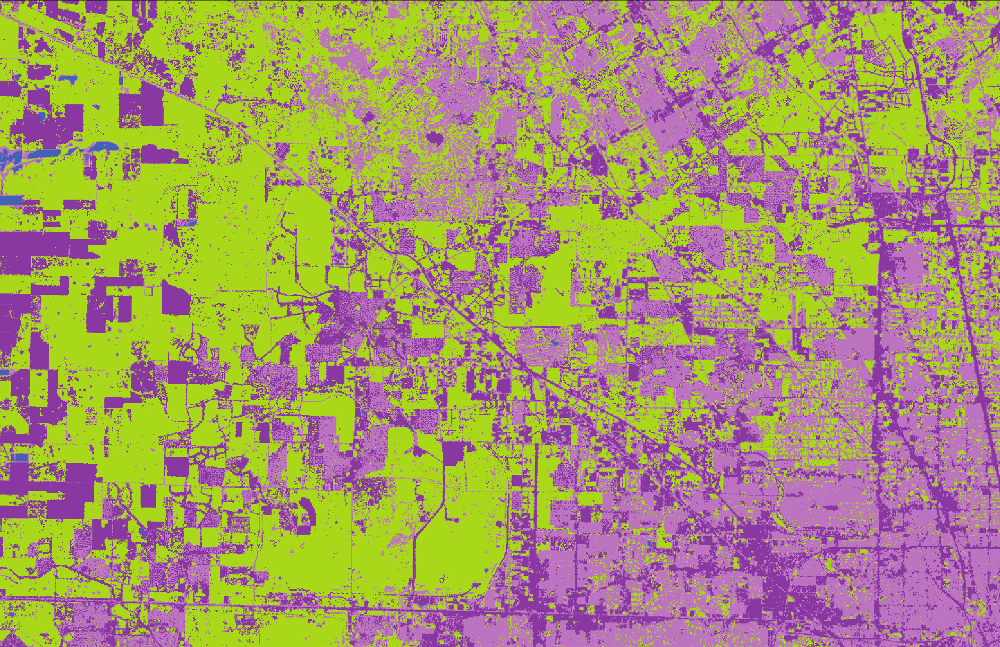
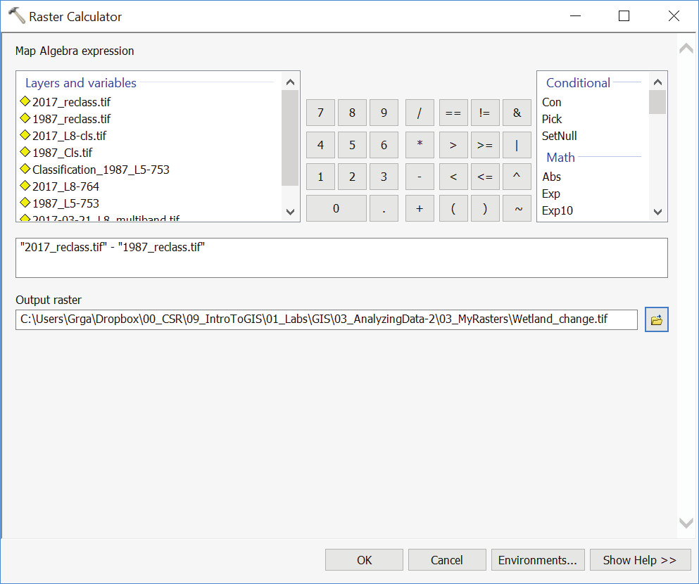
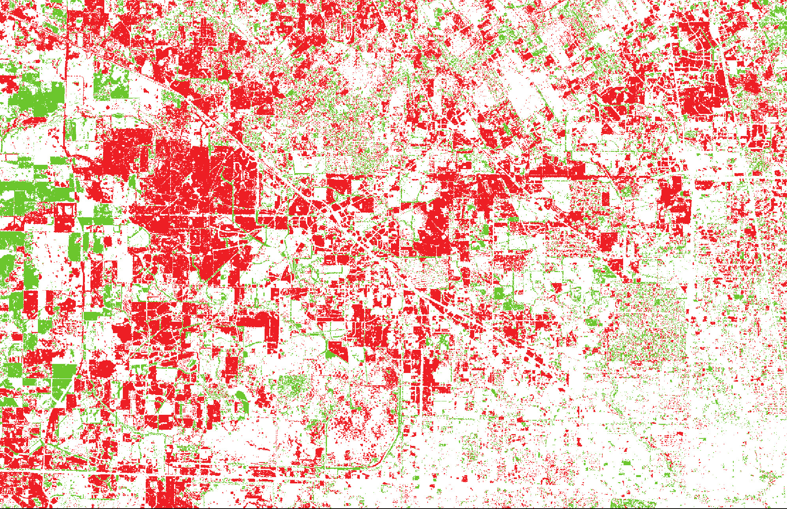
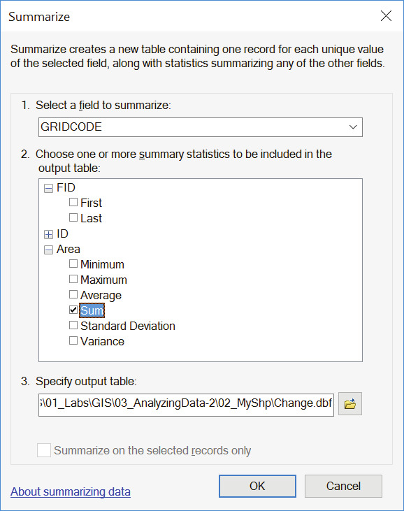
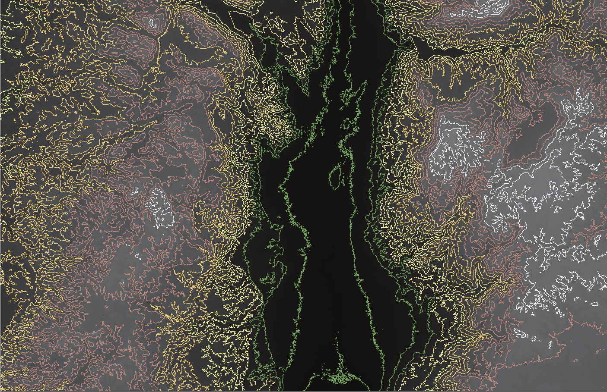
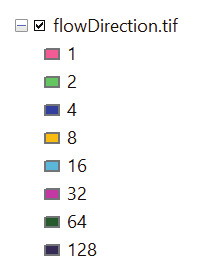
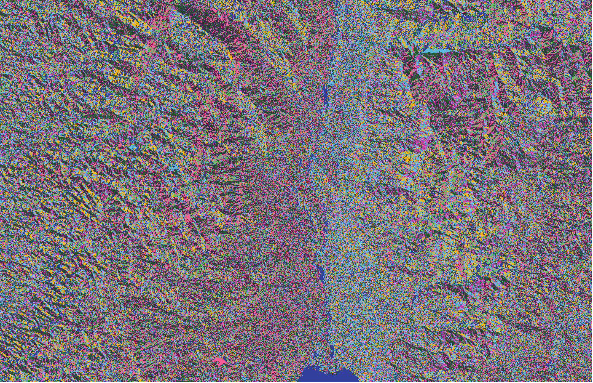
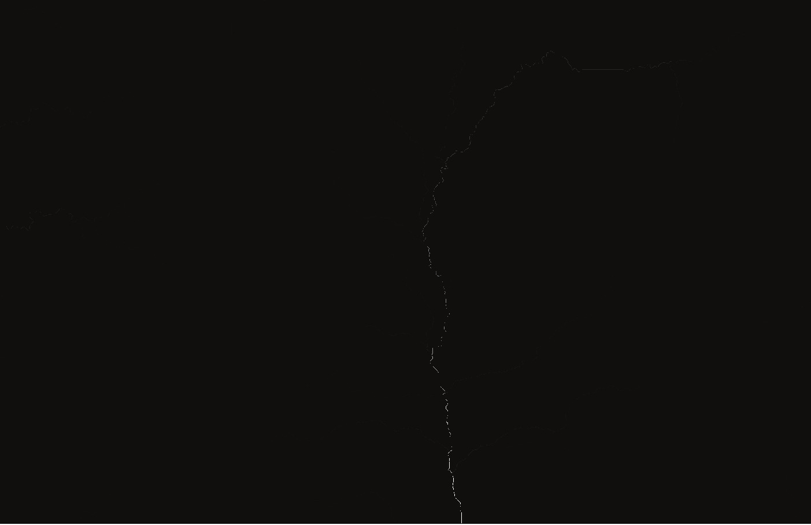

## Overview

Remote Sensing is defined as the science and technology by which characteristics of objects and areas of interest can be identified and obtained without direct contact, typically from aircraft or satellites. Advantages of remote sensing over on-site observation include:

- Ability to observe a broad area at a time
- Repeat pass observation / time-series studies (Change detection)
- Ability to identify and study the condition without visiting the area
- Obtaining “invisible” information:
- Sensors for various electromagnetic spectrum (infrared, microwave)

Remote sensing data is typically stored in raster images with varying spatial, spectral, and temporal resolutions. Raster images are composed of a matrix of picture elements, or pixels, which are the smallest units of an image. In GIS, raster image pixels are referred to as cells. Cells are normally square and may correspond to areas ranging in side length from less than 1 to more than 1,000 meters (3.3 to 3,280.8 ft).

After completing this exercise, students will have:

- Understanding how remote sensing data is organized and stored
- Conducted a multi-step, raster-based, geoprocessing-centric time series analysis
- Conducted a multi-step, vector and raster-based, geoprocessing-centric hydrology
analysis
- Represent a terrain in various different ways

Further, students should be able to:

- Access and download data from Earth Explorer
- Set geoprocessing extents in ArcGIS
- Classify land use and land cover from Landsat imagery
- Delineatewatersheds
- Visualize stream networks

### Deliverables

**Exercise Questions**. Answer all of the questions in the exercise, explaining how you got your answer. Record your answers in a simple table like the one below, saved as a CSV file. Make sure your entire answer is inside the `A` column.

| Q | A |
|---|---|
|1.1| There are 5,280 feet in a mile. |
|1.2| Raster and vector. |
|...| ... |

**Map**. As you work through the exercise you'll create several maps. For the assignment submission, arrange these in a single 11x17 layout, preferably in landscape orientation, saved as a PDF.

Name both files `yourUNI_exerciseN`, substituting your UNI, the current exercise number for N. Place them inside a `.zip` archive with the same name and submit through canvas.

---
<br/>

## Change Mapping: Houston, TX

One of the most important applications of remote sensing has been tracing the transformation of land patterns and urbanization over time. The availability of free images from Landsat satellites that have been in orbit since 1972 has made it possible for us to map land cover at different spatial and temporal scales and to create quantitative analysis of land cover changes between then and now and whatever time increment is chosen. It is up to designer, however, to interpret the ground condition, and to speculate and recognize how the changes of certain features on the ground lend themselves to a particular narrative. In this exercise, we will learn land cover classification methods using Landsat imagery, and then evaluate change in land cover between two moments in time.

Four major hurricanes – Harvey, Irma, Jose, and Maria – ravaged the US in 2017. Since hurricane forecasting has vastly improved in the past century, many lives have been saved. However, despite the accurate forecasting, the damages incurred during the last year’s season have been among the most costly in recorded history. Advances in forecasting have not stopped us from continuing to build in the floodplain.

This exercise starts with the hypothesis that in the case of Houston, TX, the loss of wetlands (resulting from lax regulations and rampant development) has been a major cause of catastrophic flooding and property damage. There is a scientific consensus that wetlands can absorb large amounts of flood water. While it is fair to say that the vanished wetlands of Houston wouldn’t have prevented all flooding, experts agree that they would have made it a lot less painful.

Using false color satellite imagery, we will visualize and measure the loss of wetlands in Houston, TX, between 1987 and 2017.

### About Multispectral Images

Some rasters have a single band, or layer, of data, while others have multiple bands. A multiband image is a collection of several monochrome images of the same scene, each of them taken with a different sensor. Each image is referred to as a band. A well known multiband (or multispectral image) is a RGB color image, consisting of a red, a green and a blue image, each of them taken with a sensor sensitive to a different wavelength. Landsat 5, produces 7-band images representing different wavelengths from the ultraviolet through the visible and infrared portions of the electromagnetic spectrum.

In this exercise, we will use data from both Landsat 5 and Landsat 8 sensors. The bands included in each are as follows:

#### Landsat 5

| Sensor | Bands | Wavelength (μm) |
| --- | --- | --- |
| Thematic Mapper (TM) | Band 1 – Blue | 0.45-0.52 |
| | Band 2 – Green | 0.52-0.60 |
| | Band 3 - Red | 0.63-0.69 |
| | Band 4 - Near Infrared (NIR) | 0.77-0.90 |
| | Band 5 - Shortwave Infrared (SWIR) 1 | 1.55-1.75 |
| | Band 6 - Thermal | 10.40-12.50 |
| | Band 7 - Shortwave Infrared (SWIR) 2 | 2.08-2.35 |

#### Landsat 8

| Sensor | Bands | Wavelength (μm) |
| --- | --- | --- |
| Operational Land Imager (OLI) | Band 1 - Ultra Blue (coastal/aerosol) | 0.435 - 0.451 |
| | Band 2 - Blue | 0.452 - 0.512 |
| | Band 3 - Green | 0.533 - 0.590 |
| | Band 4 - Red | 0.636 - 0.673 |
| | Band 5 - Near Infrared (NIR) | 0.851 - 0.879 |
| | Band 6 - Shortwave Infrared (SWIR) 1 | 1.566 - 1.651 |
| | Band 7 - Shortwave Infrared (SWIR) 2 | 2.107 - 2.294 |
| | Band 8 - Panchromatic | 0.503 - 0.676 |
| | Band 9 - Cirrus | 1.363 - 1.384 |
| Thermal Infrared Sensor (TIRS) | Band 10 - Thermal Infrared (TIRS) 1 | 10.60 - 11.19 |
| | Band 11 - Thermal Infrared (TIRS) 2 | 11.50 - 12.51 |

Further discussion of the two sensors and commentary on the potential uses of each band is available on this [page from the USGS](https://www.usgs.gov/faqs/what-are-best-landsat-spectral-bands-use-my-research?qt-news_science_products=0#qt-news_science_products).

### Downloading Landsat Imagery

There are number of ways to access and download Landsat data. We will use [USGS Earth Explorer](https://earthexplorer.usgs.gov/), one of largest public databases of remote sensing data. While the data is free, you’ll need to create an account with USGS to be given download permission. In the top-right corner of the Earth Explorer home page, click Login, then Create New Account on the next page. Once you’ve created your account, sign in.

To locate and download the data we need from Earth Explorer, there are the four basic steps, corresponding to the tabs on the left-hand panel. Note that since we're interested in comparing Houston between 1987 and 2017, we'll need to obtain a separate set of data representing each.

#### Search Criteria

Here we define the general spatial and temporal extents of the search. Pan and zoom to the general area of interest, then create a search polygon by clicking points on the map. Then set the Date Range. For the our first dataset (1987), use 01/01/1987 to 09/30/1987.


#### Data Sets

Now, we'll start to narrow down results by choosing specific data sources. Landsat 5 was active from March 1984 to January 2013, so for the 1987 dataset we want to choose Landsat 5. The "Level-1" landsat data will give us the full range of bands we need for our analysis, so we should choose “Landsat > Collection 1 Level-1” and check the box for “Landsat 4-5 TM Level-1.”


#### Additional Criteria

In the next tab we'll filter our results even further. Since we need a cloudless image to be able to determine land use, set the Land Cloud Cover to “Less than 10%.” Then set the Spacecraft Identifier to “Landsat 5” and the Day/Night indicator to “Day.”


#### Results

Now it's time to see the results. On the left you'll see a list of Landsat captures matching the search criteria. You can preview their location on the map by clicking the footprint icon, or preview the image contents. Each capture, which is called a "scene," is organized by "path" and "row" which defines its position within the grid system used to organize Landsat data. We'll use the scene at Path 25, Row 39 on **4/4/1987** for our analysis.

Download the "Level-1 GeoTIFF Data Product" for that scene, and save it to your project folder.



Now we need to repeat each step to obtain 2017 data, using the same parameters as the first time with the following exceptions:

1. Search Criteria – use 01/01/2017 to 09/30/2017 as the date range
2. Data Sets - choose Landsat 8 OLI/TIRS C1 Level-1 as the source
3. Additional Criteria - leave Sensor Identifier blank
4. Results – Download the path 25, row 39 scene **from 3/21/2017**

TIP: Knowing the path and row of your scene in advance helps defining the Area of Interest. Under Search Criteria, click on the Path/Row tab, and set the Path to “25” and Row to “39” to limit your results to this particular Landsat scene. Also, you can use the WRS-2 Path/Row to Latitude/Longitude Converter to identify the closest Landsat path and row from any given coordinates.

### Setup

For the first two exercises, you've been provied with data and a project folder structure. Since we're starting this time by obtaining our own data, we'll also need to set up our own project folder. If in doubt, use something like the following:

```sh
exercise_3
├ data_received
│ ├ raster
│ └ vector
├ data_processed
├ project_files
└ outputs
```

Your downloaded Landsat rasters should be unzipped and placed under `data_received/raster`. Take a moment to observe its contents. Notice that there are individual image files for each band, along with the metadata. The file with “MTL” suffix is the metadata file of the whole scene.

<div class='question'><strong>Question 1</strong> Open the metadata files of the imagery you’ve downloaded (acquired on 04/04/1987 and on 03/21/2017). What is the percentage of cloud cover for each scene?</div>

### Getting Started

Create a new blank map in ArcMap. From the downloaded 1987 data, add the TIFF files ending in “...B1” through “...B7”. Using the Add Data dialog you can Shift-Click to select multiple files to add at once. You may be asked if you want to generate pyramids for each layer, click OK.

Repeat for the 2017 data, this time adding the files ending in "...B1" through "...B11". Save your project file.

<!--  -->

\[Remainder of assignment to be posted by EOD 10/9\]
<!-- 
## COMPOSITE BANDS


In order to create color composite images from individual layers, we need to combine single raster datasets into multiband raster datasets. Navigate to “ArcToolbox > Data Management Tools > Raster > Raster Processing > Composite Bands.”

Using Input Rasters drop-down menu, add Landsat 5 bands 1 through 7. Save Output Raster in your “03_MyRasters” folder as “1987-04-04_L5_multiband.tif” and click “OK.” When done, remove individual Landsat 5 bands from the scene.

Repeat the step for 2017 imagery, adding Landsat 8 bands 1 through 11 as Input Rasters and saving Output Raster as “2017- 03-21_L8_multiband.tif.” When done, remove individual Landsat 8 bands from the scene.

Right-click on 1987 layer and choose “Properties...” Click on the Source tab.

<div class='question'><strong>Question 2</strong> What is the projected coordinate system associated with the 1987 imagery? Considering the linear units of that coordinate system, what is the spatial resolution (cell size) of the image?</div>

## NATURAL COLOR COMPOSITE


A natural or true-color image combines actual measurements of red, green and blue light. Temporarily toggle off the 2017 layer. Right- click on 1987 layer and choose “Properties...” Click on the Symbology tab.
The Landsat 5 bands needed to create a Natural Color Composite are Band 1 Blue, Band 2 Green, and Band 3 Red. Set the Bands to its corresponding channels:
- Red: Band_3
- Green: Band_2
- Blue: Band_1
Click “OK.” Rendering Natural Color Composite
is the closest we can get to “true color” or “photo-like” image: trees are (sorta) green, snow and clouds are white, water is (sorta) blue, etc. Toggle the 2017 layer back on and render it also as a true-color image.

<div class='question'><strong>Question 3</strong> Referring to the table on Page 3 of the document, how will you designate the bands in order to render a 2017 Natural Color Composite?
Red: Green: Blue:</div>


## FALSE COLOR COMPOSITES

Natural color composites resemble most closely to how we experience the world from ground perspective. On the other hand, false-color composites, which incorporate wavelengths of light invisible to humans, may look deceiving, but they can reveal fascinating information and are much more useful in conducting analysis. One of the most common false color composite is the so-called Color Infrared, which uses Near Infrared Band (NIR) as Red, Red Band as Green, and Green Band as Blue. This is a traditional band combination useful in seeing changes in plant health. Plants reflect NIR and green light and absorb red. Because they reflect more NIR than green, plant-covered land appears deep red.


Another common composite is so-called False Color Urban which, as the name suggests, is useful in visualizing urban environments. False color urban uses both of the SWIR bands, and red band. We will use this combination for our analysis.
ADVICE:
Go to “http://www.harrisgeospatial.com/Learn/Blogs/Blog-Details/TabId/2716/ArtMID/10198/ ArticleID/15691/The-Many-Band-Combinations-of-Landsat-8.aspx” and test few other band combinations before proceeding.

## CREATING A SUBSET OF BANDS FOR THE CLASSIFICATION


To use only the three desired bands from an existing dataset for the classification, we will create a new raster layers for them using the “Make Raster Layer” tool. Referring to the chart on the right, we will designate SWIR 2 Band as Red, SWIR 1 Band as Green, and Red Band as Blue.
In addition, in order to save time and disk space, we will limit the geoprocessing extent to the smaller area of interest.
Navigate to menu item “File > Page and Print Setup.” Uncheck the “Use Printer Paper Settings,” set the page size to “Tabloid” and Orientation to Landscape. Click “OK.”
Go to Layout View by clicking on the Layout View button or clicking through “View > Layout View.” Right-click on data frame and click through “Distribute > Fit to Margins.”


Set the Map Scale to “1:100,000” and pan
to northeastern part of the city. Navigate to menu item “Bookmarks > Create Bookmark...” Name the Bookmark “100K” and click “OK.”
Navigate to “Geoprocessing > Environments...” Under Processing Extent, set the Extent to “Same as Display.” Click “OK.” With this setting, we limited all geoprocessing operations to the extent that we currently see on the screen.
Next, navigate to “ArcToolbox > Layers and
Table Views > Make Raster Layer.” On the Make
Raster Layer tool dialog box, set the Input
Raster to “1987-04-04_L5_multiband.tif.”
Name the output raster “1987_L5-753.” In the
Bands parameter, we will select the bands
that we want to include in the new raster
layer. In the case of 1987 imagery, those are Band 7 (SWIR 2), Band 5 (SWIR 2), and Band 3 (Red). Click “OK.”


We’ve now created a subset of bands for the classification without saving a new raster dataset on the hard disk. Repeat the operation for “2017-03-21_L8_multiband.tif” raster, using Bands 7, 6, and 4. Set the Output rater layer name to “2017_L8-764.”

Toggle off the original multiband Imagery. Navigate to “Windows > Image Analysis.” On the Image Analysis window, turn on “DRA” (dynamic range adjustment) for both 2017 and 1987 subset layers. Dynamic range adjustment is a contrast stretch that is only stretches the pixel values within the display extent – not using all the pixels in the raster dataset. Next, set the stretch mode to “Std-dev.” Save your ArcMap Project.


### Image Classification

## COLLECT TRAINING SAMPLES

Now that we’re done with data exploration and preprocessing, we can start with Image Classification. The classification method we will use is called Supervised Classification, which employs our knowledge of the study area to achieve good results. Supervised Classification uses the spectral signatures obtained from training samples to classify an image. With the assistance of the Image Classification toolbar, we can easily create training samples to represent the classes we want to extract.





Click through “Customize > Toolbars > Image Classification.” Set the classification raster to “1987_ L5_753” and click on “Training Sample Manager” button. To collect training samples, we need to find areas with relatively uniform appearance on the image, and then use one of the drawing tools from the Image Classification toolbar to draw graphics to enclose them. Toggle off all other layers except the “1987_L5_753.”
Click the draw button. Notice that there is a choice of three drawing tools available: polygons, circles, and rectangles. In Data View, identify an area on the image that belongs to a known class. Use the drawing tool to define a training sample. The classes we will to identify are: Mixed Wetland, Residential, Commercial/Mixed, and Water.

1. Classify Wetlands:
Pan around the image and draw polygons on green regions. When you’ve generated enough different samples (make sure you don’t select any other color patterns), highlight all of the entries in the Training Sample Manager and click “Merge” . Name the Class “Mixed_Wetland” and give it a value of “1.”

2. Classify Residential:
Pan around image and draw polygons (or rectangles) on purple regions. Do not include major road and commercial areas around them. When done, highlight all entires in the Training Sample Manager except Wetlands and click “Merge” icon. Name the Class “Residential” and give it a value of “2.”

3. Classify Commercial/Mixed:
Pan around image and draw polygons on white, purple, and pink regions around major roads. When done, highlight all entries in the Training Sample Manager except Wetlands and Residential, and click “Merge” icon. Name the Class “Commercial/Mixed” and give it a value of “3.”

4. Classify Water:
Pan around the image and draw polygons or rectangles on dark blue regions. Name the Class “Water and give it a value of “4.”

## EVALUATE TRAINING SAMPLES


The manager provides you tools to evaluate the training samples—the Histograms tool , the Scatterplots tool , and the Statistics tool . You can use these tools to explore the spectral characteristics of different areas. You can also use these tools to evaluate training samples to see if there is enough separation between the classes.

CREATE SIGNATURE FILE:
Once you determine the training samples are
representative of the desired classes and are distinguishable from one another, a signature file can be created using the Create Signature File tool . Save signature file as “1987_classes.gsg” in “03_ MyRasters.”

APPLY CLASSIFICATION:

We can use the Maximum Likelihood Classification tool to classify the image. This tool is based on the maximum likelihood probability theory. It assigns each pixel to one of the different classes based on the means and variances of the class signatures (stored in a signature file). The tool is also accessible from the Image Classification toolbar.


The Interactive Supervised Classification tool is another way to classify your image. This tool accelerates the maximum likelihood classification process. On the Image Classification toolbar, click through “Classification > Interactive Supervised Classification.”


A new, classified image is now added to our scene. Go to layout view and get back to your “100K” extent by clicking through “Bookmarks > 100K.”

If satisfied with results, right- click on the new image layer, and click through “Data > Export Data...”

Set the Extent to “Data Frame.” Set Location to “03_MyRasters,” and name the file “1987_cls.tif.” Click “OK.” Choose suitable colors for categories.

**Repeat image classification workflow for the 2017 image.**

Save the 2017 raster as “2017_cls.tif.” Right-click and choose “Properties...” Under Symbology, click “Import...” and choose “1987_cls.tif ” as a template. Click “OK.”




### Wetland Figure-Ground

Next we will generate a figure-ground maps for wetland category from the previously generated land cover rasters. Navigate to “Arc Toolbox > Spatial Analysis Tools > Reclass > Reclassify.” Reclassify tool chages the values in a raster image.

Measure Change with Subtraction
Set Input raster to “1987_cls.tif.” Set New values to (1) non-wetland, and (2) wetlands & water: - Commercial: 1
- Residential: 1 - Wetlands: 2 - Water: 2
Save Output raster to “03_MyRasters” and name it “1987_reclass.tif.”

Next, reclassify the 2017 image using the same settings and saving the output file to “03_MyRasters” as “2017_reclass.tif.”


### Measure Change with Subtraction

## RASTER CALCULATOR



Out next step is to visualize and calculate the areas that have turned from wetlands to developed between 1987 and 2017.
Navigate to “Arc Toolbox/Spatial Analyst Tools/Map Algebra/Raster Calculator.”

1. Double-click “2017_ reclass.tif”
2. Click “-”
3. Double-click “1987_ reclass.tif”

Your formula should look like this:
“2017_reclass.tif” - “1987_reclass.tif.” Save Output Raster to “MyRasters” as “Wetland_change.tif.”


Open the Attribute Table of the resultant raster. It should have the following three values:
- (-1) change from vegetation to non-vegetation (1-2)
- (0) no change (either 2-2, or 1-1)
- (1) change from non vegetation to vegetation (2-1)
Choose suitable colors for categories.



## RASTER TO POLYGON


Finally, we want to calculate change in areal units. To do that, we need to convert the resultant raster to vector and calculate surface area.
Navigate to “Arc Toolbox/Conversion Tools/From Raster/Raster to Polygon.”
Set Input raster to “Wetland_change.tif.” Set Field to “Value.” Save the Output polygon feature class to “02_ MyShapes” as “Wetland_change.shp.”
Do not simplify polygons. Click “OK.”

Open Attribute Table of the resultant layer. Notice that the original values are now stored in “GRIDCODE” field.

Add new field, and name it “Area” of type “Double.” Calculate surface area of polygons in Acres. 



Right-click on GRIDCODE and choose “Summarize.” Twill-down Area and choose “Sum.”

Save as type: dBase table, and save as “Wetland_ change.dbf . ”Import table back into Workspace. Right-click on the table and choose “Open.” The Sum_Area for “-1” is the number of Acres that turned from wetlands to developed between 1987 and 2017.

> QUESTION 2.4: How many acres of wetlands have been lost in your scene?

> Assignment & Deliverable Format: Complete the exercise, answering the embedded questions. Prepare 3 (three) map compositions 11 x 17 inches (tabloid, landscape orientation) where left half of the map is the 1987 image and the right half is 2017 image:

> 1. Natural Color Composite
> 2. False Color Infrared
> 3. False Color Urban
 
> In addition, compose one map composition showing the change only. Compile your maps and answers to the embedded questions into a single PDF file and upload to Canvas (with Part 3) by due date.

## Terrain and Flow Mapping: Jordan River Valley

Another important application of remote sensing is the production of digital elevation models (DEMs). DEM is a representation of a surface created from terrain’s elevation data. For this exercise we will be using ASTER imagery, which is a global database of DEM data.

Any territory, regardless of its ground cover, vegetation, or man-made features, has characteristics and affordances that can be observed solely with DEM data. We will use DEM data to create terrain composites and expand on this further by conducting hydrologic calculations on the surface model such as flow directions and flow accumulations.

### Setup

Copy “AnalyzingData2_Part3.mpk” from the shared drive to “01_Project Files” and open map package. Your file should contain a natural color composite from September 2016, and a DEM raster (also known as the heightmap) covering the Sea of Galilee, Jordan River Valley, and the Dead Sea.

“Jordan_DEM” layer is a mosaic of 2 tiles downloaded from EarthExplorer. Information about ASTER Global Digital Elevation Model can be accessed here.

IMPORTANT: Before you work with a DEM, it should be projected so that your calculations will be as accurate as possible. It is critical to assign and use consistent coordinate system for all the datasets throughout this exercise. Both Landsat and DEM data in this package have already been assigned a projected coordinate system corresponding to its location - WGS_1984_UTM_Zone_36N. However, when you download data directly from Earth Explorer, you will notice that it comes “unprojected,” but with a defined WGS84 datum.

To project an unprojected DEM raster, search for “Project Raster” in the search box. Open the tool’s dialogue box. Fill in the form with DEM as the input raster, name the output raster dataset, and for the output coordinate system, select the desired system by navigating through the Projected Coordinate System folder. Click “OK.”

Also, you will sometimes need to “stitch together” two or more DEM raster tiles (or even Landsat
tiles) for your analysis. To merge multiple raster datasets together, search for “Mosaic to New Raster” tool in the search box. The input raster datasets are all the raster datasets you would like to mosaic together. You must set the pixel type and number of bands to match your existing inputs. To find out the bit depth and number of bands of your input rasters, right-click on the layer name in the ToC, and choose “Properties.” Then click on the Source tab and scroll down to find all the relevant raster dataset information.

Navigate to menu item “File > Page and Print Setup...” Create a landscape layout at size 11x17” (tabloid). Navigate to “View/Layout View” and create a full-bleed viewport that completely covers the page. Set the scale to somewhere between 1:200,000 and 1:250,000. Pan to a portion of the map that has a good height distribution. When satisfied with the view, navigate to “Bookmarks/Create Bookmark...” and save the view.

Next, we will crop all data exports to the size of the page. Navigate to “Geoprocessing/Environments... and under “Output Coordinates”, set the Output Coordinate System to “Same as Display.” Under Processing Extent, set the Extent to “Same as Display.”

### Terrain Composite

#### Create Contours

Contours are lines on a map that connect points of equal elevation based on a vertical datum, usually sea level. To create contour lines in our current scene, navigate to “ArcToolbox > Spatial Analyst Tools > Surface > Contour.”


Set Input Raster to “Jordan_DEM_utm36n.tif. ” Set Output to “02_MyShapes/Jordan_cnt100. shp,” and set Contour Interval to 100. Click “OK.”

NOTE: You can access the “Environments...” form directly from Contour dialoge box and set the Processing Extent to “Same as Display.”

Consider changing symbology, e.g: choose “Quantities/Graduated Colors”, and set the value field to “CONTOUR.” Click “Classify” and choose “Equal Interval.” Choose the number of classes and a color ramp that satisfies you.



#### Create Hillshade


Hillshade tool creates a shaded relief from a surface raster by considering the illumination source angle and shadows. By default, shadow and light are shades of gray associated with integers from 0 to 255 (increasing from black to white). Hillshading simulates the effect of the sun’s rays over the terrain and is one of the most popular techniques of cartographic relief depiction.

Navigate to “ArcToolbox > Spatial Analyst Tools > Surface > Hillshade.” Set Input Raster to “Jordan_ DEM_utm36n.tif” and Output to “03_MyRasters/ Jordan_hillshd.tif.” Click “OK.”


#### Raster Outputs

Turn off all layers except the DEM. Navigate to “File/Export Map...” Save as TIFF at 150 DPI, into your “04_Outputs” folder. Name the file “DEM_gradient.tif.” Next, open symbology tab of the DEM layer and choose another (non-grayscale) color ramp. Export as “DEM_color.tif.”
Turn off all layers except the contours. Navigate to “File/Export Map...” Save as TIFF at 150 DPI, into your “04_Outputs” folder. Name the file “Contours100.tif.”
Turn off all layers except the hillshade. Navigate to “File/Export Map...” Save as TIFF at 150, into your “04_Outputs” folder. Name the file “Hillshade.tif.”
Turn off all layers except the “Jordan_SEP_2016.tif.” Navigate “File/Export Map...” Save as TIFF at 150 DPI, into your “04_Outputs” folder. Name the file “Imagery.tif.”

> Assignment & Deliverable Format: Complete the exercise and create one 11 x 17 (tabloid, landscape orientation) terrain composite map using at least 3 of the 5 raster outputs.

TIP:
Load output raster layers to Photoshop and use DEM_gradient as an Alpha Mask. Experiment with transparencies and blending modes:


### Hydrology Analysis

Back in ArcMap, turn off all layers except DEM. Navigate to “ArcToolbox > Spatial Analyst Tools > Hydrology” to open the Hydrology toolset.

#### Fill Sinks

“Fill Sinks” function fills the sinks in a grid. If cells with higher elevation surround a cell, the water is trapped in that cell and cannot flow. This function modifies the elevation value to eliminate this problem.


Double click on the Fill tool. Set “Jordan_DEM_utm36n” as the Input Surface Raster, and save the Output raster as “DEM_fill.tif” in your working directory. Click on “Environments...” and set the Output Coordinates to “Same as Display” and Processing Extent to “Default.” This time, we do not want to clip the output to display/paper size. Click “OK.”
The resulting DEM should not be visibly different from the original version. Remove the original DEM from the scene.

NOTE: If there are natural sinks in the data (e.g. 10m deep lake), you can use the “Z limit” to retain these natural sinks. For example, if you specify Z limit as 6m, the program will not fill any sinks that are deeper than 6m. The default is to fill all sinks (do not provide any input for Z limit).

### FLOW DIRECTION


One of the keys to deriving hydrologic characteristics of a surface is the ability to determine the direction of flow from every cell in the raster. This is done with the Flow Direction tool.

Double-click on Flow Direction tool. Set the filled DEM as the Input raster and save the Output raster to “03_MyRasters” as “FlowDirection.tif.”


Click on “Environments...” and set the Output Coordinate System to “Same as Input.” Click “OK” all the way out.

A resulting raster with cells having one of the eight flow direction values (1,2,4,8,16,32,64,128) will be added to the map document. While the numbers are not intuitive, the map should be somewhat easy to read.



The table above shows how the values are set. For example, if the water would flow to the left (west) of the current processing cell, its flow direction would be coded as 16.



FLOW ACCUMULATION:

This function uses the flow direction grid to compute the total area (number of cells times the area of each cell) that is upslope and/or upstream of any given cell. Cells that lie on drainage networks have substantially higher values than cells on hill slopes.

Double-click on Flow Accumulation tool. Set the “FlowDirection.tif” as the Input raster and save the Output raster to “03_MyRasters” as “FlowAcc.tif.” Click on “Environments...” and set the Output Coordinate System to “Same as Input” and Processing Extent to “Same as Display.” Click “OK” all the way out.



STREAM THRESHOLD:
Because the flow accumulation gives the number of cells (or area) that drain to a particular cell, it can be used to define actual stream channels. We will empirically test this value until we find a split that satisfies us.
Right-click on “FlowAcc.tiff” and choose “Properties.” Under Symbology tab choose “Classified” and click the “Classify...” button. Set the number of classes to 2 end experiment with break values.


NOTE: It is assumed that a stream is formed when a certain area (threshold) drains to a point. If we assume an area of 25 km2 as the threshold to create a stream, the number of cells corresponding
to this threshold area is 27,778 (25,000,000/(30*30)). You can start with that number as a test approximation for this area.

CREATE STREAM NETWORK:


Next we will generate a new raster that will contain only the stream cells corresponding to our threshold.
Navigate to “ArcToolbox > Spatial Analyst Tools > Map Algebra > Raster Calculator.”
- Under the expressions, double- click “SetNull.”
- Inside “(,)” double-click “FlowAcc.tif ”
- Type “< 20200” (or whatever threshold value you’re using). Behind comma, type “1.”
- The full equation should read: SetNull(“FlowAcc.tif ” < 20200, 1).


This will create a calculation raster where all the cells with value greater than or equal to 20200 in FlowAcc.tif will have a value of 1, and all other cells are set to Null. Set Output raster to “03_ MyRasters/Streams.tif.” Click “OK.”

### STREAM TO FEATURE

This tool converts stream raster to a polyline feature class. Set Input stream raster to “Streams.tif,” and Input flow direction raster to “FlowDirection.tif.” Save Output to “02_MyShp” as “StreamNetwork.shp.” Click “OK.”


### DELINEATE WATERSHEDS


Finally, we will use the flow direction raster to delineate watersheds, i.e. find a set of cells that belong to the same drainage basin. In “Hydrology” toolset, double-click Basin. Set the Input flow direction rater to “FlowDirection.tif” and save Output in “03_MyRasters as “Basins.tif.”


We can use the basins raster to create polygons as watershed boundaries. Navigate to “ArcToolbox > Conversion Tools > From Raster > Raster to Polygon.”
Set Input raster to “Basins.tif” and save Output to “02_MyShp” as “Basins.shp.”

> Assignment and Deliverable Format: Complete the exercise and create one 11 x 17 (tabloid, landscape orientation) Flow Map of the Jordan River Valley using at the minimum Stream Network and Basins layers. If desired, add one or more of the terrain output layers to complete your map. Compile all “Analyzing Data 2” deliverables (Part 2 & 3) into a single PDF file and upload to Canvas by due date. -->
