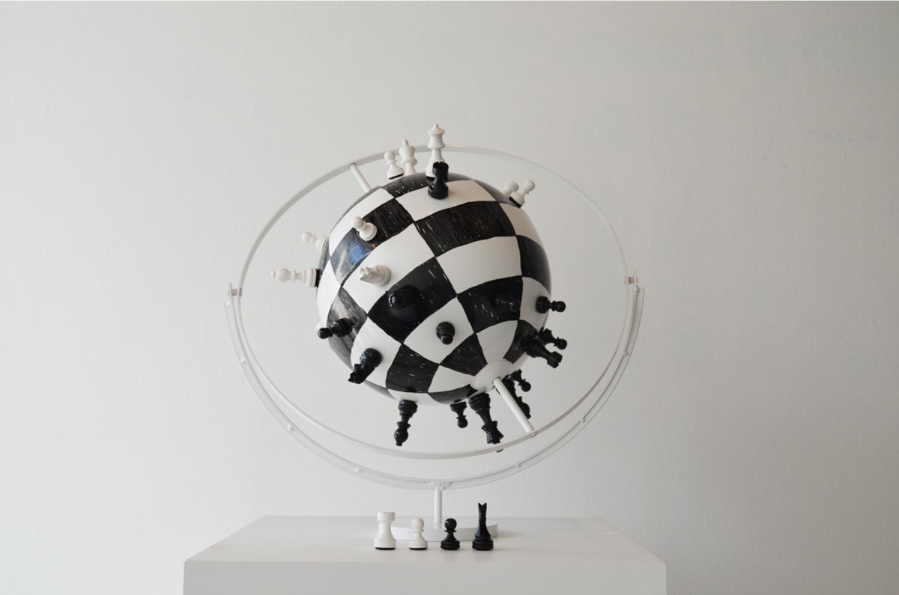
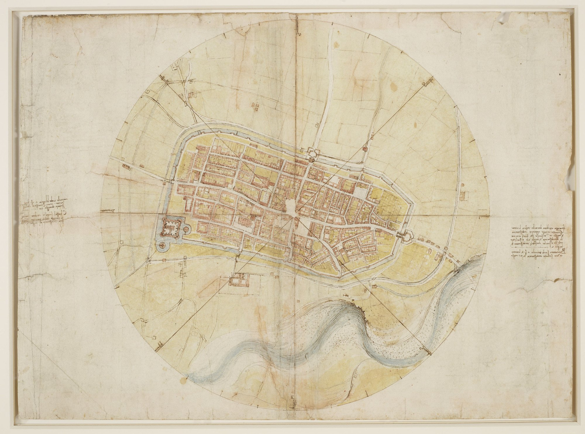

<!-- IMPORT LAYOUTS AND ADDITIONAL COMPONENTS TO INCLUDE -->
import ImageRight from '../../src/layouts/slides/imageRight';
import ImageAbove from '../../src/layouts/slides/imageAbove';
import Centered from '../../src/layouts/slides/centered';
import ThreeViewer from '../../src/components/threeViewer';

<!-- END IMPORTS, BEGIN FIRST SLIDE -->

# Coordinate Systems & Projections

---

## Recap

- Datum
- Projection
- Coordinate System (Two Kinds?)
- Geoid
- Ellipsoid

<!-- 

Datum is a reference model of the earth's surface
Projection is a defined process (algorithm) for transforming coordinates from one system to another
Projection is from geographic coordinates (~spherical) to projected coordinates (flat)
Transformation converts between different datums
Linear, angular units
Geographic vs Projected Coordinate Systems (Polar vs Rectangular coordinates)
 
Why do we need to project?
- Measurable spatial relationships from linear units. It won't work if it's not projected! 
-->

---

## Recap

- What four things can be preserved?
- Which two are mutually exclusive?
- What are three common types of projective surface?

<!-- 

Categorized by preserved properties:
- *conformal (local angle, shape)
- *equivalent/equal area
- equidistant (between one location and others)
- azimuthal (direction from one to others)
- or none

* mutually exclusive

You can't have it all. Good fast and cheap

By surface type:
- cylinder
- cone
- plane

By case:
- simple - where surface intersects the reference spheroid/ellipsoid **without distortion** once
- secant - intersects twice

Standard latitudes or meridians
Common systems
- UTM. Same cylindrical projection across 60 zones around the globe
- US State Plane. Used for surveying, less distortion than UTM

 -->

---

<ImageAbove>

Laurel Consuelo Broughton. 'The World is Flat'. 2014

</ImageAbove>

---

Alberti *Descriptio Urbis Romae*, c. 1450

<!-- 

Alberti Descriptio Urbis Romae

Simple device with "radius" and "horizon". Used to establish bearings in polar coordinates. Distance measured with an odometer - cart wheel that dropped a pellet into a cup with each revolution. Monuments in the city were plotted as a direction and a distance in the "descriptio"

 -->

---

<!-- 

No map from the time survives, but maps drawn with the same elements today line up relatively well with modern surveys

 -->

---

<ImageAbove>

Leonardo Da Vinci. Map of Imola. 1502

</ImageAbove>

<!-- 

Leonardo does the same thing
This time uses a compass as part of the survey device
Supplements the survey with sketches

ROYAL COLLECTION TRUST PAGE: 

Four lines cross the plan, forming on the circle eight points of the compass, at which the names of the winds are written in Leonardo's hand, clockwise from one o'clock.

Leonardo paced the lengths of the streets, as recorded on an annotated sketch of each quarter of the town (RCIN 912686), took bearings from the tower of the Palazzo Comunale at the central crossroads, and presumably worked out the layout by  geometry on a lost sheet, as no construction lines are visible here. The irregularities in the rectilinear street plan testify to the accuracy of the map, which may still be used to find one’s way around Imola today. But it has been noted that some details of the buildings were out-of-date, suggesting that Leonardo relied on an earlier survey of the town for the ground plans and property boundaries – though why he or Cesare cared about such details is unknown, for their primary concern must have been the fortifications of the town. Pen lines divide the circle into eight, each further subdivided into eighths by stylus lines, allowing bearings to be given with some precision. In the margins Leonardo wrote the distances and directions to other towns and cities, such as ‘Imola sees [vede] Bologna at five-eighths from the west towards the north-west at a distance of 20 miles [32 km].’

Text adapted from Leonardo da Vinci: A life in drawing, London, 2018 

SEE ALSO 

Pinto, John A. “Origins and Development of the Ichnographic City Plan.” Journal of the Society of Architectural Historians 35, no. 1 (March 1976): 35–50. https://doi.org/10.2307/988969.

-->

---

<!-- four plots of ground showing numerous blocks of buildings, with the streets numbered; some notes. Verso: further notes. This is a preliminary study for the map of Imola, RL 12284. -->

---

<!-- 

Satellite geodesy is new! Has only been possible since 1990s 
Leah will do a demo of how GPS works later in the semester
Maps going back to the 1700s are considered usable and accurate today. Measured locally
What is it relative to??
How is the map that was possible to make of an entire city ~1700 different than what we have today and for what?

Downsides: Empire. Privileges expertly produced Data over other forms of spatial information, especially privileges global standards over historical and locally situated truths
Upsides: Science, allows us to measure sea level rise 

To understand the relationship between measurement, data, ellipsoids, geoid see this: https://www.esri.com/news/arcuser/0703/geoid1of3.html
-->

---

---

<ThreeViewer path='/geoid.glb'/>

---