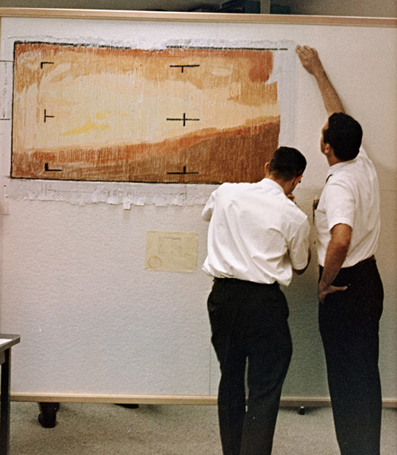
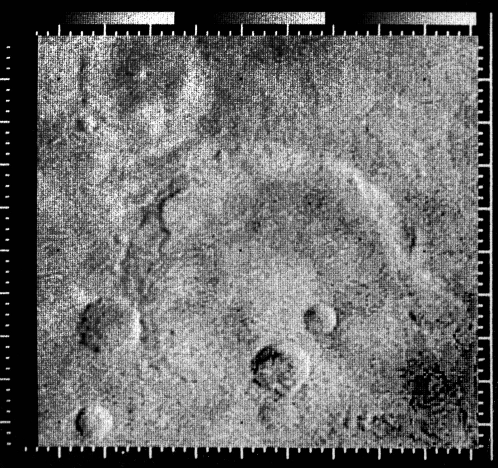

<!-- IMPORT LAYOUTS AND ADDITIONAL COMPONENTS TO INCLUDE -->
import ImageRight from '../../src/layouts/slides/imageRight';
import ImageAbove from '../../src/layouts/slides/imageAbove';
import Centered from '../../src/layouts/slides/centered';

<!-- END IMPORTS, BEGIN FIRST SLIDE -->
<Centered>
<iframe src="https://player.vimeo.com/video/453876632" width="640" height="360" frameborder="0" allow="autoplay; fullscreen" allowfullscreen></iframe>
</Centered>

---

Image: NASA

---

Image: NASA
